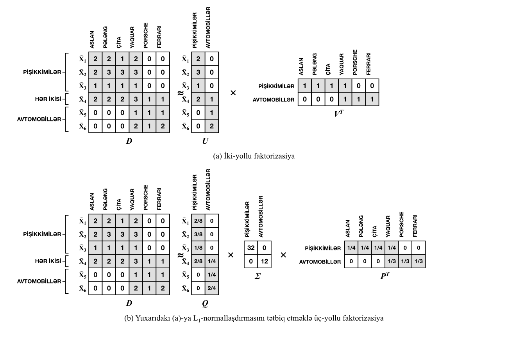
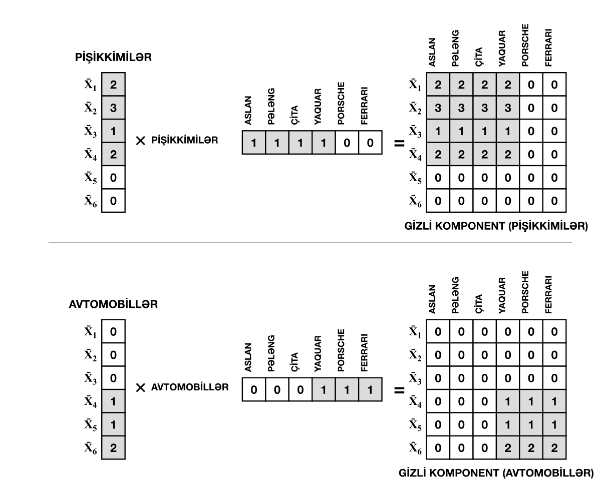
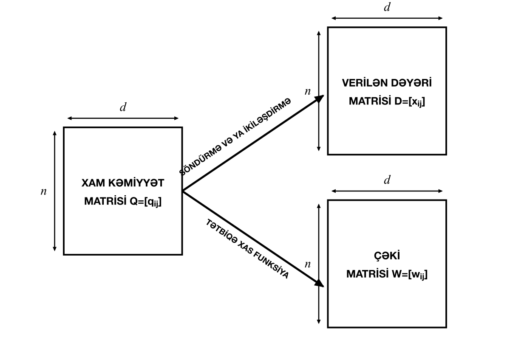
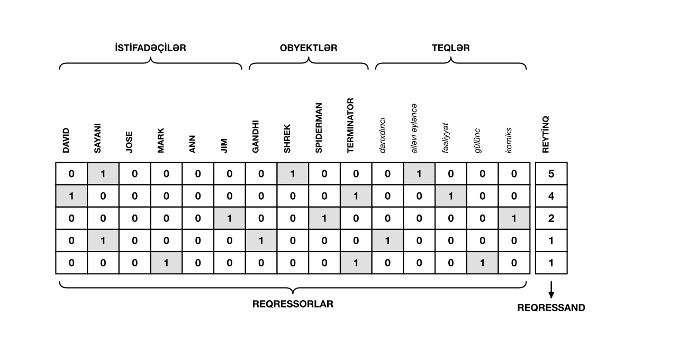

  

---

---

# Fəsil 8: Matris Faktorizasiyası

---

---

---

> *«Yalnız öz mövqeyini bilən kəs, əslində, onu da az bilir. Onun əsaslandırmaları yaxşı ola bilər və heç kim onları təkzib edə bilməz. Lakin əgər o, qarşı tərəfin dəlillərini eyni dərəcədə təkzib edə bilmirsə, hətta onların nədən ibarət olduğunu belə bilmirsə, onun hər hansı bir fikrə üstünlük vermək üçün heç bir əsası yoxdur.»*
>
> — **Con Stüart Mill (John Stuart Mill)**

## 8.1 Giriş

---

Vurma əməliyyatının skalyarlardan matrislərə ümumiləşdirilə bildiyi kimi, vuruqlara ayırma (faktorizasiya) anlayışı da skalyarlardan matrislərə təbii şəkildə ümumiləşdirilə bilər. Dəqiq matris faktorizasiyaları matrislərin vurulması üzərinə qoyulan ölçü və ranq məhdudiyyətlərini mütləq ödəməlidir. Məsələn, $n \times d$ ölçülü $A$ matrisi $B$ və $C$ kimi iki matrisin hasilinə ayrıldıqda (yəni $A = B C$), müəyyən bir $k$ sabiti üçün $B$ matrisinin ölçüsü $n \times k$, $C$ matrisinin ölçüsü isə $k \times d$ olmalıdır. Dəqiq faktorizasiyanın baş tutması üçün $k$-nın qiyməti ən azı $A$-nın ranqına bərabər olmalıdır. Bunun səbəbi ondan ibarətdir ki, $A$-nın ranqı ən çoxu $B$ və $C$-nin ranqlarının minimumuna bərabər ola bilər. Təcrübədə isə çox vaxt $A$-nın ranqından xeyli kiçik olan $k$ qiymətləri ilə təxmini (aproksimativ) faktorizasiya həyata keçirilir.

Skalyar ədədlərdə olduğu kimi, matrisin faktorizasiyası da unikal deyildir. Məsələn, 12 skalyarı $2 \times 6$ və ya $3 \times 4$ şəklində vuruqlara ayrıla bilər. Əgər həqiqi vuruqlara icazə versək, verilmiş skalyarın sonsuz sayda mümkün faktorizasiyası mövcuddur. Eyni vəziyyət matrislərə də aiddir; burada hətta faktorların ölçüləri belə fərqlənə bilər. Məsələn, eyni bir matrisin aşağıdakı faktorizasiyalarını nəzərdən keçirək:

$$\begin{bmatrix} 3 & 6 \\ 3 & 6 \end{bmatrix} = \begin{bmatrix} 1 \\ 1 \end{bmatrix} \begin{bmatrix} 3 & 6 \end{bmatrix} = \begin{bmatrix} 1 & 1 \\ 1 & 1 \end{bmatrix} \begin{bmatrix} 2 & 4 \\ 1 & 2 \end{bmatrix}$$

Aydındır ki, verilmiş matris sonsuz sayda üsulla faktorlaşdırıla bilər. Bununla belə, müəyyən növ xassələrə malik faktorizasiyalar digərlərindən qat-qat faydalıdır. Ayrışmalarda adətən iki növ xassə arzu olunur:

1. *Dəqiq ayrışma ilə xətti cəbr xassələri:* Bu hallarda faktorizasiyanın fərdi komponentlərinin xüsusi xətti cəbri və ya həndəsi xassələrə (məsələn, ortoqonallıq, matrisin üçbucaqlı forması və s.) malik olduğu ayrışmalar qurmağa cəhd edilir.

© Springer Nature Switzerland AG 2020 C. C. Aggarwal, <i>Linear Algebra and Optimization for Machine Learning</i>, [https://doi.org/10.1007/978-3-030-40344-7_8](https://doi.org/10.1007/978-3-030-40344-7_8)

---

Bu növ xassələr baza vektorlarının qurulması kimi müxtəlif xətti cəbr tətbiqləri üçün olduqca əlverişlidir. İndiyə qədər gördüyümüz bütün ayrışmalar -- LU ayrışması, QR ayrışması və SVD məhz xətti cəbr xassələrinə malikdir.

2. *Təxmini ayrışma ilə optimallaşdırma və sıxılma xassələri:* Bu hallarda daha böyük bir matrisi iki və ya daha çox kiçik matrisə faktorlaşdırmağa cəhd edilir. Kəsilmiş SVD bu növ faktorizasiyanın klassik nümunəsidir. Aşağıdakı faktorizasiyanı yaratmaq üçün ranq-$k$-ya kəsilmiş $n \times d$ ölçülü $D$ matrisini nəzərdən keçirək:

$$ D \approx Q_k \Sigma_k P_k^T  \quad (8.1)$$

Burada $Q_k$ $n \times k$ ölçülü ortoqonal matris, $\Sigma_k$ mənfi olmayan elementləri olan $k \times k$ ölçülü diaqonal matris, $P_k$ isə $d \times k$ ölçülü ortoqonal matrisdir. Hər üç matrisdəki elementlərin ümumi sayı $(n + d + k)k$-dır ki, bu da böyük $n$ və $d$ qiymətlərində ilkin matrisdəki $n d$ sayda elementdən çox vaxt xeyli kiçikdir. Məsələn, $n = d = 10^6$ və $k = 1000$ olduqda, $D$-dəki elementlərin sayı $10^{12}$ olduğu halda, faktorlaşdırılmış matrislərdəki elementlərin ümumi sayı təxminən $2 \times 10^9$-dur ki, bu da ilkin elementlərin sayının cəmi 0.2%-ni təşkil edir.

Tək qiymət ayrışması həm xətti cəbr xassələri baxımından (dəqiq formada istifadə edildikdə), həm də sıxılma xassələri baxımından (kəsilmiş formada istifadə edildikdə) faydalı olan nadir faktorizasiyalardan biridir. $k$ qiyməti faktorizasiyanın *ranqı* adlanır. Matris faktorizasiyasına $D \approx U V^T$ optimallaşdırma mərkəzli baxışı maşın öyrənməsində $D$, $U$ və $V$-ni aşağıdakı kimi konseptuallaşdırmaqla xüsusilə dəyərli olur:

1. $D$ sənədlərdəki ($D$-nin sətirləri) sözlərin ($D$-nin sütunları) tezliklərini saxlayan sənəd-termin matrisi olduqda, $U$-nun sətirləri sənədlərin gizli (latent) təsvirlərini, $V$-nin sətirləri isə sözlərin gizli təsvirlərini təmin edir.

2. Reytinq -- istifadəçinin bir obyektə (məsələn, filmə) verdiyi ədədi qiymətdir. Tövsiyə sistemləri istifadəçilərin hələ qiymətləndirmədikləri obyektlər üzrə reytinqlərini proqnozlaşdırmaq üçün onların mövcud reytinqlərini toplayır. $D$ istifadəçi-obyekt reytinq matrisi olduqda, sətirlər istifadəçilərə, sütunlar isə obyektlərə uyğun gəlir. $D$-nin elementləri reytinqləri ehtiva edir. Matris faktorizasiyası natamam $D \approx U V^T$ matrisini yalnız müşahidə olunan reytinqlərdən istifadə etməklə parçalayır. $U$-nun sətirləri istifadəçilərin gizli təsvirlərini, $V$-nin sətirləri isə obyektlərin gizli təsvirlərini verir. $U V^T$ matrisi bütün reytinq matrisini (o cümlədən çatışmayan reytinqlər üçün proqnozları) yenidən bərpa edir.

3. Tutaq ki, $D \approx U V^T$ bir qrafın qonşuluq matrisidir və $D$-nin $(i, j)$-ci elementi $i$ və $j$ təpələri arasındakı tilin çəkisini göstərir. Belə halda, həm $U$, həm də $V$-nin sətirləri təpələrin gizli təsvirləridir. $U$ və $V$-nin gizli təsvirləri klasterləşdirmə və əlaqələrin (linklərin) proqnozlaşdırılması kimi tətbiqlərdə istifadə edilə bilər (bax: Fəsil 9 və 10).

Optimallaşdırma mərkəzli baxışda ayrılmış matrislər üzərinə optimallaşdırma probleminin məhdudiyyətləri kimi xüsusi xassələr qoyula bilər (məsələn, matris elementlərinin mənfi olmaması). Bu xüsusi xassələr müxtəlif tətbiq sahələrində olduqca əhəmiyyətlidir.

Bu fəsil aşağıdakı kimi təşkil edilmişdir. Növbəti bölmə matris faktorizasiyasına optimallaşdırma mərkəzli baxışın ümumi icmalını təqdim edir. Məhdudiyyətsiz matris faktorizasiyası metodları 8.3-cü Bölmədə müzakirə olunur. Mənfi olmayan matris faktorizasiyası metodları 8.4-cü Bölmədə təqdim edilir. Çəkili matris faktorizasiyası metodları 8.5-ci Bölmədə izah olunur. Loqistik və maksimum haşiyəli matris faktorizasiyaları 8.6-cı Bölmədə araşdırılır. Ümumiləşdirilmiş aşağı ranqlı modellər 8.7-ci Bölmədə verilir. Paylaşılan matris faktorizasiyası metodları 8.8-ci Bölmədə şərh edilir. Faktorizasiya maşınları 8.9-cu Bölmədə təhlil olunur. Fəslin xülasəsi 8.10-cu Bölmədə təqdim olunur.

---

## 8.2 Optimallaşdırma Əsaslı Matris Faktorizasiyası

Matris faktorizasiyasının optimallaşdırma mərkəzli baxışı onun maşın öyrənməsi tətbiqlərindəki faydalılığının əsasını təşkil edir. Optimallaşdırma mərkəzli baxış matrisin sıxılmış təsvirini yaradır ki, bu da təsadüfi küy və artefaktlardan qurtulmaqda, habelə görünən verilənlərdən görünməyən verilənlərə çatışmayan qiymətlərin proqnozunu ümumiləşdirməkdə həmişə kömək edir. Axı verilənlərdə təkrarlanan qanunauyğunluqlar -- yeni verilən nümunələrində çatışmayan qiymətləri təxmin etmək üçün zəruri olan nümunələr -- məhz sıxılmış təsvirdə qorunub saxlanılır.

Aşağıda biz $n \times d$ ölçülü $D$ matrisinin $n \times k$ ölçülü $U$ matrisi və $d \times k$ ölçülü $V$ matrisinə iki-yollu faktorizasiyasını müzakirə edirik; baxmayaraq ki, 7-ci Fəslin 7.2.7-ci Bölməsindəki yanaşmadan istifadə etməklə istənilən iki-yollu faktorizasiya $Q \Sigma P^T$ üç-yollu faktorizasiyasına (SVD kimi) çevrilə bilər. Faktorizasiyanın əsas məqsədi elə bir məqsəd funksiyası formalaşdırmaqdır ki, $U V^T$ hasili ilkin $D$ matrisini ən yaxşı şəkildə bərpa etmək üçün istifadə oluna bilsin. Optimallaşdırma əsaslı matris faktorizasiyasının əksər formaları $U$ və $V$ matrisləri üzərində qurulmuş aşağıdakı ümumi optimallaşdırma modelinin xüsusi hallarıdır:

[
  > 
    *Maksimallaşdır:* $D$ və $U V^T$ elementləri arasında oxşarlıq \
    *Şərtlər:* $U$ və $V$ üzərinə qoyulan məhdudiyyətlər

Məhdudiyyətlər faktor matrislərinin spesifik xassələrini təmin etmək üçün istifadə olunur. Ən geniş istifadə olunan məhdudiyyət $U$ və $V$ matrislərinin mənfi olmamasıdır. SVD-də istifadə olunan ən sadə məqsəd funksiyası $\| D - U V^T \|_F^2$ Frobenius normasıdır. Ehtimal modelləri qurmaq üçün loqarifmik doğruluq (log-likelihood) və I-divergensiya kimi digər məqsəd funksiyalarından da istifadə edilir. Matris faktorizasiyası modellərinin əksəriyyəti qabarıq (convex) deyildir; buna baxmayaraq, qradiyent enişi bu məsələlərdə olduqca uğurla işləyir.

Bəzi hallarda məqsəd funksiyasında konkret matris elementlərini çəkiləndirmək mümkündür. Əslində, müəyyən matris növləri üçün matris elementini birbaşa çəki kimi qəbul etmək daha məntiqlidir. Bu yanaşma tövsiyə sistemlərində qeyri-aşkar (örtülü / implicit) əks-əlaqə verilənləri üçün xarakterikdir; burada bütün elementlərin ikili (binar) olduğu fərz edilir və sıfırdan fərqli elementlərin qiymətlərinə çəki kimi baxılır. Məsələn, müxtəlif istifadəçilərə (sətir identifikatorları) məhsulların (sütun identifikatorları) satış miqdarını ehtiva edən matris, istifadəçilərin məhsulları alıb-almamasına görə həmişə ikili qəbul edilir. Bu yanaşma mətn sahəsində tezlik matrisləri ilə işləyərkən də bəzən tətbiq olunur [101].

Loqistik matris faktorizasiyası metodları müəyyən bir elementin 1 olması ehtimalını maddiləşdirmək üçün $U V^T$-nin elementlərinə loqistik siqmoid funksiyası tətbiq edir. Bu cür yanaşma mənfi olmayan qiymətlərin ikili hadisələrin tezlikləri kimi qəbul edilməli olduğu matrislər üçün çox yaxşı işləyir. Buradakı əsas ideya $D$-nin elementlərinin $P = \text{Sigmoid}(U V^T)$ matrisindəki ehtimallarla hər bir elementin dəfələrlə seçilməsi nəticəsində əldə edilən tezliklər olduğunu fərz etməkdir. Siqmoid funksiyası aşağıdakı kimi təyin olunur:

$$\text{Sigmoid}(x) = 1 / (1 + \exp(-x))$$

Qeyd edək ki, $D$ və $P$ eyni ölçülü iki matrisdir və $D$-dəki tezliklər təxminən $P$-dəki elementlərlə mütənasib olacaqdır:

$$D \sim P \text{-dən seçmə yolu ilə əldə edilən tezliklərin təcəssümü}$$

Optimallaşdırma modeli bu ehtimal modelinə əsaslanan loqarifmik doğruluq funksiyasını maksimallaşdırır. Maşın öyrənməsində təəccüblü dərəcədə çox sayda tətbiqin matris faktorizasiyasının xüsusi halı olduğunu göstərmək mümkündür; xüsusilə də faktorizasiyaya mürəkkəb məqsəd funksiyaları və məhdudiyyətləri daxil etməyə hazır olduqda.

---

Matris faktorizasiyası əlamət mühəndisliyi, klasterləşdirmə, nüvə metodları, əlaqələrin proqnozlaşdırılması və tövsiyə sistemlərində geniş istifadə olunur. Hər bir halda əsas sirr qarşıda duran məsələ üçün uyğun məqsəd funksiyasını və müvafiq məhdudiyyətləri seçməkdir. Konkret nümunə kimi göstərəcəyik ki, $k$-means alqoritmi bəzi xüsusi məhdudiyyətlər daxilində matris faktorizasiyasının xüsusi halıdır.

### 8.2.1 Nümunə: Məhdudiyyətli Matris Faktorizasiyası Kimi K-Means

$k$-means alqoritmi $n \times d$ ölçülü $D$ verilənlər matrisindəki hər bir sətrin ona ən yaxın mərkəzdən olan kvadratik xətalarının cəmini minimuma endirən $k$ sayda mərkəz (sentroid) çoxluğunu təyin edir. Faktorizasiyaya əlavə məhdudiyyətlər daxil etməklə bu alqoritmin matris faktorizasiyasının xüsusi halı olduğunu göstərmək olar. Müvafiq olaraq $n \times k$ və $d \times k$ ölçülü $U$ və $V$ faktor matrisləri ilə aşağıdakı optimallaşdırma problemini nəzərdən keçirək:

[
  > 
    $ \text{Minimuma endir}_{U, V} \| D - U V^T \|_F^2 $ \
    *Şərtlər:* \
    $U$-nun sütunları qarşılıqlı ortoqonaldır \
$$u_{i j} \in {0, 1}$$

Bu, qarışıq tamədədli matris faktorizasiyası (mixed integer matrix factorization) problemidir, çünki $U$-nun elementləri ikili (0 və ya 1) qiymətlər almaqla məhdudlaşdırılmışdır. Ekvivalent optimallaşdırma formalaşdırması 4-cü Fəslin 4.10.3-cü Bölməsində verilmişdir. Bu halda göstərmək olar ki, $U$-nun hər bir sətri həmin sətrin klaster mənsubiyyətinə uyğun gələn dəqiq bir ədəd 1 saxlayır. $V$-nin hər bir sütunu isə $k$ klasterdən birinin $d$-ölçülü mərkəzini (sentroidini) ehtiva edir. 4-cü Fəslin 4.10.3-cü Bölməsində müzakirə edildiyi kimi, bu optimallaşdırma problemi blok koordinat enişi (block coordinate descent) vasitəsilə həll edilə bilər ki, bu da $k$-means alqoritminin özü ilə tamamilə eynidir. $k$-means-in matris faktorizasiyasının xüsusi halı olması faktı matris faktorizasiyası metodları ailəsinin geniş çeşidli maşın öyrənməsi metodları ilə əlaqə qurmaqda nə dərəcədə zəngin ifadə qabiliyyətinə malik olduğunu nümayiş etdirir. Buna görə də, bu fəsil matris faktorizasiyasının həyata keçirilməsinin çoxsaylı üsullarını və onların tətbiqlərini dərindən araşdıracaqdır.

## 8.3 Məhdudiyyətsiz Matris Faktorizasiyası

Məhdudiyyətsiz matris faktorizasiyası problemi aşağıdakı kimi təyin olunur:

$$\text{Minimuma endir}_{U, V} J = 1/2 \| D - U V^T \|_F^2$$

Burada $D$, $U$ və $V$ müvafiq olaraq $n, d$ və $k$ ölçülərinə malik matrislərdir. $k$-nın qiyməti adətən $D$ matrisinin ranqından xeyli kiçik seçilir. 7-ci Fəslin 7.3.2-ci Bölməsində müzakirə edilən bu problemin SVD ilə eyni həlli verdiyini göstərmək olar. 7-ci Fəsildə göstərildiyi kimi, $D^T D$-nin ən böyük xüsusi vektorları $V$-nin sütunlarını, $D D^T$-nin ən böyük xüsusi vektorları isə $U$-nun sütunlarını təşkil edir. $V$-nin sütunları vahid normaya normalizasiya olunur, $U$-nun sütunları isə elə normallaşdırılır ki, $i$-ci sütunun norması $D$-nin $i$-ci tək qiymətinə bərabər olsun.

Bununla belə, bir çox alternativ optimallar mümkündür. Məsələn, hətta sütunların normallaşdırılması belə unikal deyildir. $V$-nin sütunlarını vahid normaya gətirmək əvəzinə, $U$-nun sütunlarını asanlıqla vahid normaya gətirib $V$-nin hər bir sütununun normasını müvafiq qaydada tənzimləmək olar. Əsas məqam ondan ibarətdir ki, $U$ və $V$-nin $i$-ci sütunlarının normalarının hasili $D$-nin $i$-ci tək qiymətinə bərabər olmalıdır. Bundan əlavə, $U$ və $V$-nin sütunları

---

optimal həllin mövcud olması üçün mütləq ortonormal dəstlər təşkil etməli deyildir. Verilmiş optimal $(U_0, V_0)$ cütü üçün $V_0$-ın sütun fəzasının bazasını ortoqonal olmayan başqa bir bazaya dəyişmək və $U_0$-ı həmin ortoqonal olmayan baza sistemindəki müvafiq koordinatlara uyğunlaşdırmaq olar ki, $U_0 V_0^T$ hasili dəyişməz qalsın. Bu məqamı dərindən anlamaq üçün oxucuya aşağıdakı məsələni həll etmək tövsiyə olunur:

> 
  *Çalışma 8.3.1* Tutaq ki, $D \approx Q_k \Sigma_k P_k^T$ $D$-nin ranq-$k$ SVD-sidir. 7-ci Fəsildəki nəticələr göstərir ki, $(U, V) = (Q_k \Sigma_k, P_k)$ bu bölmədə irəli sürülən məhdudiyyətsiz matris faktorizasiyası problemi üçün ranq-$k$ optimal həll matrisləri cütünü təmsil edir. Göstərin ki, ixtiyari $k \times k$ ölçülü tərsi olan $R_k$ matrisi üçün $(U, V) = (Q_k \Sigma_k R_k^T, P_k R_k^{-1})$ cütü də məhdudiyyətsiz matris faktorizasiyası problemi üçün alternativ optimal həlldir.

### 8.3.1 Tam Müəyyən Edilmiş Matrislərlə Qradiyent Enişi

Bu bölmədə biz qradiyent enişindən istifadə etməklə məhdudiyyətsiz optimallaşdırma probleminin həllini tapan metodu araşdıracağıq. Bu yanaşma tək qiymət ayrışmasının təmin etdiyi ortoqonal həllərə zəmanət vermir; lakin formalaşdırma ekvivalentdir və (ideal halda) eyni məqsəd funksiyası qiymətinə malik həllə gətirib çıxarmalıdır. Bu yanaşmanın həm də belə bir üstünlüyü var ki, o, matrisdə çatışmayan qiymətlərin olması kimi daha çətin şəraitlərə asanlıqla uyğunlaşdırıla bilər. Bu növ yanaşmanın ən təbii tətbiqi tövsiyə sistemlərində matris faktorizasiyasıdır. Tövsiyə sistemləri SVD ilə eyni optimallaşdırma formalaşdırmasından istifadə edir; lakin faktorizasiyanın nəticəsində alınan baza vektorlarının ortoqonal olmasına zəmanət verilmir.

Qradiyent enişini həyata keçirmək üçün məhdudiyyətsiz optimallaşdırma probleminin $U = [u_{i q}]$ və $V = [v_{j q}]$ matrislərindəki parametrlərə nəzərən törəməsini hesablamaq lazımdır. Ən sadə yanaşma $J$ məqsəd funksiyasının $U$ və $V$ matrislərindəki hər bir parametrə nəzərən törəməsini hesablamaqdır. Əvvəlcə məqsəd funksiyası müxtəlif matrislərdəki fərdi elementlər baxımından ifadə edilir. $n \times d$ ölçülü $D$ matrisinin $(i, j)$-ci elementini $x_{i j}$ ilə işarə edək. Onda məqsəd funksiyası $D$, $U$ və $V$ matrislərinin elementləri baxımından aşağıdakı kimi yenidən yazıla bilər:

$$\text{Minimuma endir} J = 1/2 \sum_{i=1}^n \sum_{j=1}^d (x_{i j} - \sum_{s=1}^k u_{i s} \cdot v_{j s})^2$$

$e_{i j} = x_{i j} - \sum_{s=1}^k u_{i s} \cdot v_{j s}$ kəmiyyəti $(i, j)$-ci element üçün faktorizasiyanın xətasıdır. Qeyd edək ki, $J$ məqsəd funksiyası $e_{i j}$-lərin kvadratlarının cəmini minimuma endirir. Məqsəd funksiyasının $U$ və $V$ matrislərindəki parametrlərə nəzərən xüsusi törəmələri aşağıdakı kimi hesablana bilər:

$$(\partial J) / (\partial u_{i q}) = \sum_{j=1}^d (x_{i j} - \sum_{s=1}^k u_{i s} \cdot v_{j s}) (-v_{j q}) = \sum_{j=1}^d (e_{i j})(-v_{j q}) \quad \forall i \in {1 \dots n}, q \in {1 \dots k}$$

$$(\partial J) / (\partial v_{j q}) = \sum_{i=1}^n (x_{i j} - \sum_{s=1}^k u_{i s} \cdot v_{j s}) (-u_{i q}) = \sum_{i=1}^n (e_{i j})(-u_{i q}) \quad \forall j \in {1 \dots d}, q \in {1 \dots k}$$

---

Bu törəmələri matris formasında da ifadə etmək olar. $E = [e_{i j}]$ xətaların $n \times d$ ölçülü matrisi olsun. Matris diferensial hesabının məxrəc düzülüşündə (denominator layout) törəmələr aşağıdakı kimi ifadə edilə bilər:

$$(\partial J) / (\partial U) = -(D - U V^T) V = -E V$$

$$(\partial J) / (\partial V) = -(D - U V^T)^T U = -E^T U$$

Yuxarıdakı matris hesabı eyniliyini sağ tərəfdəki matrislərin hər birinin $(i, q)$-ci və $(j, q)$-ci elementlərini açmaq və onların müvafiq skalyar $(\partial J) / (\partial u_{i q})$ və $(\partial J) / (\partial v_{j q})$ törəmələrinə ekvivalent olduğunu göstərməklə yoxlamaq olar. 4-cü Fəslin matris hesabı eyniliklərindən birbaşa istifadə edən alternativ yanaşma Şəkil 8.1-də təqdim edilmişdir. Oxucu ardıcıllığı pozmadan bu çıxarılışı ötürə bilər.

Bu optimallaşdırma problemi üçün optimallıq şərtləri bu törəmələri 0-a bərabər etməklə əldə edilir. Beləliklə, $D V = U V^T V$ və $D^T U = V U^T U$ optimallıq şərtlərini alırıq. Bu optimallıq şərtlərinin SVD-dən əldə edilən $U = Q_k \Sigma_k$ və $V = P_k$ həlli üçün ödəndiyini göstərmək mümkündür.

> 
  *Çalışma 8.3.2* Tutaq ki, $Q_k \Sigma_k P_k^T$ $D$ matrisinin ranq-$k$ kəsilmiş SVD-sidir. Göstərin ki, $U = Q_k \Sigma_k$ və $V = P_k$ həlli $D V = U V^T V$ və $D^T U = V U^T U$ optimallıq şərtlərini ödəyir. \
  _İpucu:_ SVD-nin ranq-1 matrislərin cəmi kimi spektral ayrışmasından istifadə edin.

Optimallıq şərti standart SVD həllinə ($D \approx [Q_k \Sigma_k] P_k^T$) gətirib çıxarsa da, qradiyent enişindən istifadə etməklə də optimal həll tapmaq olar. Qradiyent enişi üçün yeniləmə qaydaları aşağıdakı kimidir:

$$U \Leftarrow U - \alpha (\partial J) / (\partial U) = U + \alpha E V$$

$$V \Leftarrow V - \alpha (\partial J) / (\partial V) = V + \alpha E^T U$$

Burada $\alpha > 0$ öyrənmə dərəcəsidir (learning rate).

Optimallaşdırma modeli SVD ilə eynidir. Əgər yuxarıda qeyd olunan qradiyent enişi metodundan istifadə olunarsa (əvvəlki fəslin qüvvət iterasiyası metodu əvəzinə), adətən məqsəd funksiyasının qiyməti baxımından eyni dərəcədə yaxşı olan, lakin $U$-nun (və ya $V$-nin) sütunlarının qarşılıqlı ortoqonal olmadığı həllər əldə ediləcəkdir. Qüvvət iterasiyası metodları ortoqonal sütunlara malik həllər verir. Qradiyent enişi ilə ortonormal sütunlara malik standartlaşdırılmış SVD həlli birbaşa əldə olunmasa da, $U$-nun $k$ sütunu $Q_k$-nın sütunları ilə eyni altfəzanı, $V$-nin sütunları isə $P_k$-nın sütunları ilə eyni altfəzanı gərəcəkdir.[^1]

Qradiyent enişi yanaşması $D$ matrisi seyrək olduqda yeniləmələr üçün matrisdən elementləri seçməklə (sampling) olduqca səmərəli şəkildə həyata keçirilə bilər. Bu, mahiyyətcə stoxastik qradiyent enişi metodudur. Başqa sözlə, bir $(i, j)$ elementi seçilir və onun xətası hesablanır.

[^1]: Bu, $D^T D$-nin ən böyük $k$ sayda xüsusi qiymətinin fərqli olması fərziyyəsi altında baş verəcəkdir. Bərabər (təkrarlanan) xüsusi qiymətlər SVD üçün qeyri-unikal həllə gətirib çıxarır ki, bu da bəzən ranq-$k$ həlli daxilində ən kiçik xüsusi qiymətə uyğun gələn altfəzada bəzi fərqliliklərə səbəb ola bilər.

---

[
  #block(width: 98%, stroke: 0.5pt + luma(160), inset: 1em, radius: 4pt)[
    #text(size: 9pt)[
      Ranq-$k$ ölçülü $U$ və $V$ matrisləri ilə $n \times d$ ölçülü $D$ matrisi üçün aşağıdakı məqsəd funksiyasını nəzərdən keçirək:
$$J = 1/2 \| D - U V^T \|_F^2$$

      $J$-nin $U$ və ya $V$-yə nəzərən törəməsini hesablamaq istədiyimizdən asılı olaraq, Frobenius normasını sətir və ya sütun vektor normalarına ayıraraq matris diferensial hesabından istifadə etmək olar. $X_i$ $D$-nin $i$-ci sətri (sətir vektoru), $d_j$ $D$-nin $j$-ci sütunu (sütun vektoru), $u_i$ $U$-nun $i$-ci sətri (sətir vektoru), $v_j$ isə $V$-nin $j$-ci sətri (sətir vektoru) olsun. Onda Frobenius normasını sətir üzrə parçalasaq:
$$J = 1/2 \sum_{i=1}^n \| X_i - u_i V^T \|^2 = 1/2 \sum_{i=1}^n \underbrace{X_i X_i^T}_{\text{Sabit}} - \sum_{i=1}^n X_i V u_i^T + 1/2 \sum_{i=1}^n u_i V^T V u_i^T$$

      Sabit olmayan iki həddin $u_i$-yə nəzərən törəməsini hesablamaq üçün 4-cü Fəslin Cədvəl 4.2(a)-dakı (i) və (ii) eyniliklərindən istifadə edə bilərik. Bu, aşağıdakını verir:
$$(\partial J) / (\partial u_i^T) = -V^T X_i^T + V^T V u_i^T$$

$$(\partial J) / (\partial [u_1^T \dots u_n^T]) = -V^T [X_1^T \dots X_n^T] + V^T V [u_1^T \dots u_n^T]$$

$$(\partial J) / (\partial U^T) = -V^T D^T + V^T V U^T$$

$$(\partial J) / (\partial U) = -D V + U V^T V = -(D - U V^T) V$$

      $V$-yə nəzərən törəməni hesablamaq üçün $J$-dəki kvadratik Frobenius normasını sütun üzrə parçalamaq lazımdır:
$$J = 1/2 \sum_{j=1}^d \| d_j - U v_j^T \|^2 = 1/2 \sum_{j=1}^d \underbrace{d_j^T d_j}_{\text{Sabit}} - \sum_{j=1}^d d_j^T U v_j^T + 1/2 \sum_{j=1}^d v_j U^T U v_j^T$$

      Cədvəl 4.2(a)-dakı (i) və (ii) eyniliklərindən yenidən istifadə edərək:
$$(\partial J) / (\partial v_j^T) = -U^T d_j + U^T U v_j^T$$

      Əvvəlki halda olduğu kimi, $V$-nin müxtəlif sətirləri üçün törəmələri birləşdirsək:
$$(\partial J) / (\partial V) = -D^T U + V U^T U = -(D - U V^T)^T U$$

    
    ---)
    
    [*Şəkil 8.1: Matris diferensial hesabı vasitəsilə faktorizasiya qradiyentlərinin alternativ çıxarılışı*]

---

$e_{i j}$ hesablandıqdan sonra $U$-nun $i$-ci $u_i$ sətrinə və $V$-nin $j$-ci $v_j$ sətrinə (bunlar həm də gizli faktorlar adlanır) aşağıdakı yeniləmələr tətbiq olunur:

$ u_i arrow.l.double u_i + alpha e_(i j) v_j \
  v_j arrow.l.double v_j + alpha e_(i j) u_i $

Yaxınlaşma (konvergensiya) əldə olunana qədər matrisin seçilmiş elementləri üzrə dövr edilir. Yeniləmələr üçün elementləri seçə bilməyimiz o deməkdir ki, gizli faktorları öyrənmək üçün tam müəyyən edilmiş matrislərə ehtiyacımız yoxdur. Bu təməl fikir tövsiyə sistemlərinin əsasını təşkil edir.

> 
  *Çalışma 8.3.3 (Nizamlanmış Matris Faktorizasiyası)* Tutaq ki, $D$ $n \times d$ ölçülü matrisdir və biz onu $U$ və $V$-yə ranq-$k$ ayrışması ilə faktorlaşdırmaq istəyirik. Fərz edək ki, $1/2 \| D - U V^T \|_F^2$ məqsəd funksiyasına $\lambda / 2 (\| U \|_F^2 + \| V \|_F^2)$ nizamlama hədləri əlavə edilmişdir. Göstərin ki, qradiyent enişi yeniləmələri aşağıdakı kimi dəyişməlidir:
  $ U arrow.l.double U(1 - alpha lambda) + alpha E V \
    V arrow.l.double V(1 - alpha lambda) + alpha E^T U $

$U$ və $V$ matrislərinin elementləri aşağıdakı kimi başlanğıc qiymətləndirilə (initialize edilə) bilər. Əvvəlcə $U$-dakı bütün $n \times k$ element standart normal paylanmadan müstəqil olaraq seçilir və sonra hər bir sütun vahid vektora normallaşdırılır. Qeyd edək ki, $n$ böyük olduqda $U$ matrisi təxminən qarşılıqlı ortoqonal sütunlara malik olur. $V$ matrisi isə $D^T U$ kimi seçilir. Bu yanaşma təmin edir ki, $U V^T$ hasili $U U^T D$ hasilini versin; burada $U$-nun təxmini ortoqonallığı səbəbindən $U U^T$ (təxminən) proyeksiya matrisidir. Beləliklə, ilkin hasil artıq hədəf matrisə çox yaxın olur.

### 8.3.2 Tövsiyə Sistemlərinə Tətbiqi

$D$ $n$ sayda istifadəçinin $d$ sayda obyekt üzrə reytinqlərini təmsil edən $n \times d$ ölçülü reytinq matrisi olsun. $D$ matrisindəki $(i, j)$-ci element $x_{i j}$ ilə işarə olunur və $i$ istifadəçisinin $j$ obyekti üçün verdiyi reytinqi göstərir. Tövsiyə tətbiqlərinin əsas fərqləndirici xüsusiyyəti reytinqlərin böyük əksəriyyətinin çatışmamasıdır (boş olmasıdır). Çünki birgə filtrləmə (kollaborativ filtrləmə) tətbiqlərində istifadəçilər obyektlərin əksəriyyətinə reytinq vermirlər. Çatışmayan elementləri olan reytinq matrisinin nümunəsi Şəkil 8.2-də göstərilmişdir. Başqa sözlə, $x_{i j}$-nin qiyməti yalnız elementlərin kiçik bir altçoxluğu üçün müşahidə olunmuşdur (məlumdur). Tövsiyə probleminin məqsədi məlum reytinqlərdən istifadə edərək çatışmayan reytinqləri proqnozlaşdırmaqdır.

Bütün müşahidə olunan reytinqlərin indeksləri çoxluğunu $S$ ilə işarə edək:

$$ S = {(i, j) : x_{i j} \text{müşahidə olunub}}  \quad (8.2)$$

Ənənəvi matris faktorizasiyasında olduğu kimi, natamam $D$ reytinq matrisini yalnız $S$-dəki elementlərdən istifadə etməklə faktorlaşdırmaq istəyirik. Tövsiyə sistemləri terminologiyasında $n \times k$ ölçülü $U$ matrisi *istifadəçi faktor matrisi* (user factor matrix), $d \times k$ ölçülü $V$ matrisi isə *obyekt faktor matrisi* (item factor matrix) adlanır. Müşahidə olunan verilənlərin azlığı səbəbindən birgə filtrləmə tətbiqlərində nizamlama xüsusilə vacibdir. Buna görə də məqsəd funksiyasına əlavə $\lambda / 2 (\| U \|_F^2 + \| V \|_F^2)$ həddi əlavə edilir.

İstifadəçi və obyekt faktor matrisləri öyrənildikdən sonra bütün reytinq matrisi $U V^T$ kimi bərpa edilə bilər. Praktikada $D$ matrisinin yalnız konkret $(i, j)$-ci elementini proqnozlaşdırmaq kifayətdir:

$$ \hat{x}_{i j} = \sum_{s=1}^k u_{i s} \cdot v_{j s}  \quad (8.3)$$

---

[
  #block(breakable: false)[
    
| | **GLADIATOR** | **GODFATHER** | **BEN-HUR** | **GOODFELLAS** | **SCARFACE** | **SPARTACUS** |
|---|:---:|:---:|:---:|:---:|:---:|:---:|
| **TOM** | 1 | | | 5 | | 2 |
| **JIM** | | 5 | | | 4 | |
| **JOE** | 5 | 3 | | 1 | | |
| **ANN** | | | 3 | | | 4 |
| **JILL** | | | | 3 | 5 | |
| **SUE** | 5 | | 4 | | | |

*Şəkil 8.2: Çatışmayan reytinqləri olan reytinq matrisi*
Sol tərəfdəki reytinq üzərindəki "şlyapa" simvoluna (sirkumfleks) diqqət yetirin; bu, həmin qiymətin müşahidə edilən deyil, proqnozlaşdırılan dəyər olduğunu göstərir. Müşahidə olunan reytinqlər üçün proqnozun xətası $e_{i j} = x_{i j} - \hat{x}_{i j}$-dir.

Onda məqsəd funksiyası $D$-dəki müşahidə olunan elementlər baxımından aşağıdakı kimi formalaşdırıla bilər:

$$\text{Minimuma endir} J = 1/2 \sum_{(i,j} \in S) (x_{i j} - \sum_{s=1}^k u_{i s} \cdot v_{j s})^2 + \lambda / 2 \sum_{i=1}^n \sum_{s=1}^k u_{i s}^2 + \lambda / 2 \sum_{j=1}^d \sum_{s=1}^k v_{j s}^2$$

Əvvəlki bölmədəki məqsəd funksiyasından əsas fərq kvadratik xətanın hesablanmasında yalnız $S$-dəki müşahidə olunmuş elementlərin istifadə edilməsi və nizamlamanın tətbiqidir. Əvvəlki bölmədə olduğu kimi, məqsəd funksiyasının müxtəlif parametrlərə nəzərən xüsusi törəmələrini aşağıdakı kimi hesablaya bilərik:

$$(\partial J) / (\partial u_{i q}) = \sum_{j: (i,j} \in S) (e_{i j})(-v_{j q}) + \lambda u_{i q} \quad \forall i \in {1 \dots n}, q \in {1 \dots k}$$

$$(\partial J) / (\partial v_{j q}) = \sum_{i: (i,j} \in S) (e_{i j})(-u_{i q}) + \lambda v_{j q} \quad \forall j \in {1 \dots d}, q \in {1 \dots k}$$

Bu xətaları matris hesabı qeydində də təyin etmək olar. $E$ hər bir müşahidə olunan $(i, j) \in S$ elementi üçün $e_{i j}$, çatışmayan hər bir element üçün isə 0 olan $n \times d$ ölçülü xəta matrisi olsun. Qeyd edək ki (klassik SVD-dən fərqli olaraq), $E$ xəta matrisi artıq seyrəkdir, çünki elementlərin böyük əksəriyyəti verilməmişdir.

$$(\partial J) / (\partial U) = -E V + \lambda U$$

$$(\partial J) / (\partial V) = -E^T U + \lambda V$$

---

Diqqət yetirin ki, törəmənin forması nizamlanma həddi və xəta matrisinin təyini istisna olmaqla ənənəvi SVD ilə tamamilə eynidir. Onda $U$ və $V$ matrisləri üçün qradiyent enişi yeniləmələri belə olar:

$$U \Leftarrow U - \alpha (\partial J) / (\partial U) = U(1 - \alpha \lambda) + \alpha E V$$

$$V \Leftarrow V - \alpha (\partial J) / (\partial V) = V(1 - \alpha \lambda) + \alpha E^T U$$

Burada $\alpha > 0$ öyrənmə dərəcəsidir. $E$ matrisi açıq şəkildə seyrək xəta matrisi kimi saxlanıla bilər və yuxarıdakı yeniləmələr yalnız seyrək matris vurmalarından istifadə etməklə həyata keçirilə bilər. Tövsiyə sistemləri ədəbiyyatında bu yanaşmaya tək qiymət ayrışması kimi istinad edilsə də (məhdudiyyətsiz matris faktorizasiyası ilə SVD optimallaşdırma modeli arasındakı əlaqəyə görə), bu yanaşma ilə adətən $U$ və $V$-nin ortoqonal sütunları əldə edilmir.

#### 8.3.2.1 Stoxastik Qradiyent Enişi

Stoxastik qradiyent enişi 4-cü Fəslin 4.5.2-ci Bölməsində təqdim edilmişdir. Matris faktorizasiyası baxımından stoxastik qradiyent enişinin əsas ideyası yeniləmələri tək-tək yerinə yetirmək üçün $S$-dəki müşahidə olunmuş elementlərdən seçim etməkdir. Yuxarıdakı yeniləmələrdə $(i, j)$-ci $e_{i j}$ xəta elementi yalnız və yalnız $U$-nun $i$-ci sətrinə və $V$-nin $j$-ci sətrinə təsir edir. Stoxastik qradiyent enişi bütün elementlər üzrə yeniləmələri cəmləmək əvəzinə, bu yeniləmələri fərdi elementlər əsasında həyata keçirir. $u_i$ $U$-nun $i$-ci sətrini ehtiva edən $k$-ölçülü sətir vektoru, $v_j$ isə $V$-nin $j$-ci sətrini ehtiva edən $k$-ölçülü sətir vektoru olsun. Onda stoxastik qradiyent enişi hər bir $(i, j) \in S$ elementindən təsadüfi ardıcıllıqla keçir və aşağıdakı yeniləmələri yerinə yetirir:

$$u_i \Leftarrow u_i(1 - \alpha \lambda) + \alpha e_{i j} v_j$$

$$v_j \Leftarrow v_j(1 - \alpha \lambda) + \alpha e_{i j} u_i$$

Burada $\alpha > 0$ öyrənmə dərəcəsidir. $S$-dəki hər bir müşahidə olunan element üçün $U$ və $V$ matrislərində dəqiq $2k$ element yenilənir. Buna görə də müşahidə olunan bütün reytinqlər üzrə stoxastik qradiyent enişinin tək bir dövrü dəqiq $2k|S|$ yeniləmə aparır. $U$ və $V$ matrisləri $(0, M / \sqrt{k})$ aralığında bərabərpaylanmış təsadüfi qiymətlərlə başlanğıc vəziyyətinə gətirilir; burada $M$ reytinqin maksimum mümkün qiymətidir. Bu cür başlanğıc vəziyyəti ilkin $U V^T$ hasilinin orijinal reytinq matrisi ilə eyni tərtibli qiymətlər verməsini təmin edir. Daha sonra yaxınlaşma əldə olunana qədər yuxarıda göstərilən yeniləmələr icra edilir. Stoxastik qradiyent enişi adi qradiyent enişindən daha sürətlə yığılmağa meyllidir və tövsiyə sistemlərində ən çox seçilən metod hesab olunur.

#### 8.3.2.2 Koordinat Enişi

Koordinat enişi metodu 4-cü Fəslin 4.10-cu Bölməsində təqdim edilmişdir. Koordinat enişi metodlarının əsas ideyası hər addımda eyni anda yalnız bir parametri optimallaşdırmaqdır. Matris faktorizasiyası kontekstində bu, $U$ və $V$-də tək bir parametri optimallaşdırmaq deməkdir.

Aşağıda biz tövsiyə sistemlərində istifadə olunan (natamam matrislərlə) $J$ məqsəd funksiyasından istifadə edəcəyik, çünki o, məqsəd funksiyasının daha ümumi formasıdır. $S$ müşahidə olunan indekslər çoxluğu və $e_{i j}$ xətası kimi bütün işarələmələr əvvəlki bölmədəki kimidir. $J$ məqsəd funksiyasının $u_{i q}$-yə nəzərən xüsusi törəməsini 0-a bərabər etdikdə, hər bir $i \in {1 \dots n}$ və $q \in {1 \dots k}$ üçün alırıq:

---

$$(\partial J) / (\partial u_{i q}) = \sum_{j: (i,j} \in S) (e_{i j})(-v_{j q}) + \lambda u_{i q} = 0$$

$$u_{i q} (\lambda + \sum_{j: (i,j} \in S) v_{j q}^2) = \sum_{j: (i,j} \in S) (e_{i j} + u_{i q} v_{j q}) v_{j q}$$

$$u_{i q} = (\sum_{j: (i,j} \in S) (e_{i j} + u_{i q} v_{j q}) v_{j q}) / (\lambda + \sum_{j: (i,j} \in S) v_{j q}^2)$$

Yuxarıdakı cəbri çevrilmənin ikinci addımında yeniləmənin dayanıqlı formasını yaratmaq üçün hər iki tərəfə $\sum_{j: (i,j} \in S) u_{i q} v_{j q}^2$ kəmiyyəti əlavə edilmişdir. Cəbri tənliyin son forması hər iki tərəfdə $u_{i q}$ saxlayır və buna görə də iterativ yeniləmə təmin edir. Oxşar iterativ yeniləmə qaydası hər bir $v_{j q}$ üçün də çıxarıla bilər. $u_{i q}$ və $v_{j q}$-nin müxtəlif qiymətləri üçün yeniləmələr ardıcıl olaraq aşağıdakı kimi icra olunmalıdır:

$$u_{i q} \Leftarrow (\sum_{j: (i,j} \in S) (e_{i j} + u_{i q} v_{j q}) v_{j q}) / (\lambda + \sum_{j: (i,j} \in S) v_{j q}^2) \quad \forall i, q$$

$$v_{j q} \Leftarrow (\sum_{i: (i,j} \in S) (e_{i j} + u_{i q} v_{j q}) u_{i q}) / (\lambda + \sum_{i: (i,j} \in S) u_{i q}^2) \quad \forall j, q$$

Alqoritm sadəcə $U$ və $V$ matrislərindəki parametrlərin təsadüfi qiymətləri ilə başlayır və yuxarıdakı yeniləmələri yerinə yetirir. Yaxınlaşma əldə olunana qədər $U$ və $V$-dəki $(m + n) \cdot k$ sayda parametr üzrə bu yeniləmələrlə dövrlər təkrarlanır.

#### 8.3.2.3 Blok Koordinat Enişi: Növbələşən Ən Kiçik Kvadratlar (ALS)

Növbələşən ən kiçik kvadratlar (ALS) blok koordinat enişinin bir formasıdır və 4-cü Fəslin 4.10.2-ci Bölməsində təqdim edilmişdir. Bu yanaşma $U$ və $V$ matrislərinin ilkin cütü ilə başlayır və sonra digər matrisi sabit saxlamaqla $U$ və $V$-nin yenilənməsi arasında növbələşir. Proses belə işləyir:

1. *$U$ sabit saxlanılır:* $V$-nin $d$ sayda sətrinin hər biri üçün məsələ ən kiçik kvadratlar reqressiyası kimi həll edilir. Hər bir halda ən kiçik kvadratlar modelini qurmaq üçün yalnız $S$-dəki müşahidə olunmuş reytinqlərdən istifadə edilə bilər. $v_j$ $V$-nin $j$-ci sətri olsun. Optimal $v_j$ vektorunu təyin etmək üçün biz $\sum_{i: (i,j} \in S) (x_{i j} - \sum_{s=1}^k u_{i s} v_{j s})^2$ cəmini minimuma endirmək istəyirik ki, bu da $v_{j 1} \dots v_{j k}$ dəyişənlərinə nəzərən ən kiçik kvadratlar reqressiyası məsələsidir. $u_{i 1} \dots u_{i k}$ hədləri sabit qiymətlər kimi qəbul edilir, $v_{j 1} \dots v_{j k}$ isə optimallaşdırma dəyişənləridir. Beləliklə, $j$-ci obyekt üçün $k$-ölçülü $v_j$ vektoru ən kiçik kvadratlar reqressiyası ilə tapılır. Ümumilikdə $d$ sayda belə reqressiya məsələsi həll edilməlidir və hər bir məsələ $k$ dəyişənə malikdir. Hər bir obyekt üçün reqressiya məsələsi digərlərindən müstəqil olduğundan, bu addım asanlıqla paralelləşdirilə bilər.

2. *$V$ sabit saxlanılır:* $U$-nun $n$ sayda sətrinin hər biri üçün məsələ ən kiçik kvadratlar reqressiyası kimi həll edilir. Yalnız $S$-dəki müəyyən edilmiş reytinqlərdən istifadə olunur. $u_i$ $U$-nun $i$-ci sətri olsun. Optimal $u_i$ vektorunu təyin etmək üçün $\sum_{j: (i,j} \in S) (x_{i j} - \sum_{s=1}^k u_{i s} v_{j s})^2$ cəmi $u_{i 1} \dots u_{i k}$ dəyişənlərinə nəzərən minimuma endirilir. Cəmi $n$ sayda belə reqressiya məsələsi icra olunmalıdır və hər bir reqressiya məsələsi $k$ dəyişənə malikdir. Hər bir istifadəçi üçün reqressiya məsələsi müstəqil olduğundan, bu addım asanlıqla paralelləşdirilə biləndir.

---

Ən kiçik kvadratlar reqressiyası 4-cü Fəslin 4.7-ci Bölməsində müzakirə olunmuşdur.

## 8.4 Mənfi Olmayan Matris Faktorizasiyası (Nonnegative Matrix Factorization)

Mənfi olmayan matris faktorizasiyası matrisi mənfi olmayan faktor matrislərinin hasili kimi ifadə edir. İki mənfi olmayan matrisin hasili də mənfi olmayan matris olduğundan, ilkin matrisin də mənfi olmayan elementlərdən ibarət olması məntiqlidir. Mənfi olmamaq xassəsi real həyatda rast gəlinən və tezlik saylarını ehtiva edən bir çox matris tərəfindən ödənilir:

1. İstifadəçinin satın aldığı məhsulların miqdarı mənfi olmayan kəmiyyətdir. Matrisin sətirləri istifadəçilərə, sütunları isə məhsullara uyğundur. $(i, j)$-ci element $i$ istifadəçisinin $j$ məhsulundan neçə ədəd aldığını göstərir.

2. Sənəddə müxtəlif sözlərin rastgəlmə tezlikləri mənfi olmayan ədədlərdir. Bu halda sətirlər sənədlərə, sütunlar isə lüğətdəki bütün sözlər toplusuna uyğun gəlir. $(i, j)$-ci element $i$-ci sənəddə lüğətin $j$-ci sözünün işlənmə tezliyini ifadə edir.

3. Qraf tətbiqlərində kvadrat qonşuluq matrisi tillərlə əlaqəli mənfi olmayan çəkiləri saxlaya bilər. Məsələn, müəlliflər arasındakı elmi nəşr şəbəkəsinin qonşuluq matrisində $(i, j)$ elementi $i$ və $j$ müəlliflərinin bir-biri ilə neçə dəfə əməkdaşlıq etdiyini əks etdirir.

Faktorların mənfi olmaması nə üçün faydalıdır? Daha sonra görəcəyimiz kimi, faktor matrislərinin mənfi olmaması faktorizasiyanın olduqca yüksək dərəcədə interpretasiya oluna bilməsi ilə nəticələnir. İkincisi, faktor matrislərinin mənfi olmaması faktorizasiyanın nizamlanmasında mühüm rol oynayır. Mənfi olmamaq kimi məhdudiyyətlərin əlavə edilməsi faktorizasiyanın xətasını həmişə artırsa da, faktorizasiyadan əldə edilən proqnozlar seçimdənkənar (out-of-sample) verilənlər üçün (məsələn, çatışmayan verilənlərlə proqnoz verərkən) çox vaxt yaxşılaşır. Bu, maşın öyrənməsində optimallaşdırma məqsədlərinin ənənəvi optimallaşdırma məqsədlərindən nə dərəcədə fərqləndiyini nümayiş etdirən parlaq bir nümunədir (bax: 4-cü Fəsil, Bölmə 4.5.3).

### 8.4.1 Frobenius Norması ilə Optimallaşdırma Problemi

Mənfi olmayan matris faktorizasiyası üçün ən geniş yayılmış formalaşdırma məqsəd funksiyası kimi Frobenius normasından istifadə edir və faktor matrisləri üzərinə mənfi olmamaq məhdudiyyəti qoyur. $D = [x_{i j}]$ elementləri mənfi olmayan $n \times d$ ölçülü verilənlər matrisi olsun. $U$ və $V$ müvafiq olaraq $n \times k$ və $d \times k$ ölçülü faktor matrisləridir, belə ki, $D \approx U V^T$. Onda mənfi olmayan matris faktorizasiyası problemi aşağıdakı kimi formalaşdırılır:

[
  > 
    $ \text{Minimuma endir} J = 1/2 \| D - U V^T \|_F^2 + \lambda / 2 \| U \|_F^2 + \lambda / 2 \| V \|_F^2 $ \
    *Şərtlər:* \
$$U >= 0, \quad V >= 0$$

Aydındır ki, bu problem məhdudiyyətsiz matris faktorizasiyasından yalnız mənfi olmamaq məhdudiyyətlərinin əlavə edilməsi ilə fərqlənir. Bunlar məhdudiyyətli optimallaşdırma kontekstində həlli xüsusilə asan olan qutu məhdudiyyətləridir (bax: 6-cı Fəsil, Bölmə 6.3.2).

---

#### 8.4.1.1 Qutu Məhdudiyyətləri ilə Proyeksiya Edilmiş Qradiyent Enişi

Optimallaşdırma problemi yalnız qutu məhdudiyyətlərinə malik olduğundan, onun həlli xüsusilə asandır. Əsas ideya məhdudiyyətsiz optimallaşdırmada tətbiq edilən eyni qradiyent enişi metodundan istifadə etməkdir. Ardınca optimallaşdırma dəyişənləri onların mənfi olmayan qiymətlərinə yenidən təyin edilir. Başqa sözlə, $U$ və $V$ matrislərinin mənfi olan hər bir elementi 0-a bərabər edilir.

Məhdudiyyətsiz matris faktorizasiyası üzrə 8.3.1 və 8.3.2-ci Bölmələrdə müzakirə edildiyi kimi, $J$ məqsəd funksiyasının $U$ və $V$ faktor matrislərinə nəzərən qradiyentləri belədir:

$$(\partial J) / (\partial U) = -(D - U V^T) V + \lambda U$$

$$(\partial J) / (\partial V) = -(D - U V^T)^T U + \lambda V$$

Beləliklə, mənfi olmamaq məhdudiyyətlərindən narahat olmadan qradiyent enişi yeniləmələri aşağıdakı kimidir:

$$U \Leftarrow U - \alpha (\partial J) / (\partial U) = U(1 - \alpha \lambda) + \alpha (D - U V^T) V$$

$$V \Leftarrow V - \alpha (\partial J) / (\partial V) = V(1 - \alpha \lambda) + \alpha (D - U V^T)^T U$$

Əsas fərq ondan ibarətdir ki, hər bir matris elementinin mənfi olmamasını təmin etmək üçün yeniləmələrə iki addım əlavə edilir:

$$U \Leftarrow \max(U, 0), \quad V \Leftarrow \max(V, 0)$$

Bu prosedur qutu məhdudiyyətləri üzrə 6.3.2-ci Bölmədə müzakirə edilən ideyalara əsaslanır. Təcrübədə proyeksiya edilmiş qradiyent enişi mənfi olmayan matris faktorizasiyası üçün nadir hallarda istifadə olunur.

### 8.4.2 Duallıqdan (Qoşmalıqdan) İstifadə Edərək Həll

Bu bölmədə biz Laqranj relaksasiyasından istifadə etməklə mənfi olmamaq probleminin həllini təqdim edəcəyik (bax: 6-cı Fəsil, Bölmə 6.4). 6.4-cü Bölmədə istifadə olunan konvensiyalarla uyğunluq təşkil etmək üçün bərabərsizlik məhdudiyyətlərini $-U <= 0$ və $-V <= 0$ şəklində çeviririk. Qeyd edək ki, $U$ və $V$ matrislərindəki hər bir element üçün bir məhdudiyyət mövcuddur, buna görə də matris elementlərinin sayı qədər Laqranj vuruğuna ehtiyacımız var. $U$-dakı $(i, s)$-ci $u_{i s}$ elementi üçün $\alpha_{i s} >= 0$ Laqranj vuruğunu, $V$-dəki $(j, s)$-ci $v_{j s}$ elementi üçün isə $\beta_{j s} >= 0$ Laqranj vuruğunu daxil edirik. Bütün Laqranj parametrlərini birləşdirərək $(n + d) \cdot k$ ölçülü $(\alpha, \beta)$ vektorunu qura bilərik. Onda Laqranj relaksasiyası aşağıdakı kimi ifadə olunur:

$$ L = 1/2 \| D - U V^T \|_F^2 + \lambda / 2 \| U \|_F^2 + \lambda / 2 \| V \|_F^2 - \sum_{i=1}^n \sum_{r=1}^k u_{i r} \alpha_{i r} - \sum_{j=1}^d \sum_{r=1}^k v_{j r} \beta_{j r}  \quad (8.4)$$

Laqranj optimallaşdırmasının minimaks problemi belə ifadə edilir:

$$ \max_{\alpha >= 0, \beta >= 0} \min_{U, V} L  \quad (8.5)$$

6.4-cü Bölmədə müzakirə edildiyi kimi, ilk addım Laqranj relaksasiyasının (minimallaşdırma) optimallaşdırma dəyişənləri $u_{i s}$ və $v_{j s}$-ə nəzərən qradiyentini hesablamaqdır. Buna görə də biz aşağıdakılara sahibik:

---

$$ (\partial L) / (\partial u_{i s}) = -(D V)_{i s} + (U V^T V)_{i s} + \lambda u_{i s} - \alpha_{i s} \quad \forall i \in {1 \dots n}, s \in {1 \dots k}  \quad (8.6)$$

$$ (\partial L) / (\partial v_{j s}) = -(D^T U)_{j s} + (V U^T U)_{j s} + \lambda v_{j s} - \beta_{j s} \quad \forall j \in {1 \dots d}, s \in {1 \dots k}  \quad (8.7)$$

Aşağıdakı şərtləri əldə etmək üçün bu xüsusi törəmələr sıfıra bərabər edilir:

$$ -(D V)_{i s} + (U V^T V)_{i s} + \lambda u_{i s} - \alpha_{i s} = 0 \quad \forall i \in {1 \dots n}, s \in {1 \dots k}  \quad (8.8)$$

$$ -(D^T U)_{j s} + (V U^T U)_{j s} + \lambda v_{j s} - \beta_{j s} = 0 \quad \forall j \in {1 \dots d}, s \in {1 \dots k}  \quad (8.9)$$

Biz Laqranj parametrlərini aradan qaldırmaq və optimallaşdırma şərtlərini sırf $U$ və $V$ terminlərində qurmaq istəyirik. Bu kontekstdə Kun-Takker (KKT) optimallıq şərtlərinin tamamlayıcı qeyri-sərtlik komponentləri köməyə çatır. Bu şərtlər bütün parametrlər üzrə $u_{i s} \alpha_{i s} = 0$ və $v_{j s} \beta_{j s} = 0$ şəklindədir. (8.8) tənliyini $u_{i s}$-ə vurmaqla və (8.9) tənliyini $v_{j s}$-ə vurmaqla, sırf primal dəyişənlərdən ibarət şərtlər alırıq:

$$ -(D V)_{i s} u_{i s} + (U V^T V)_{i s} u_{i s} + \lambda u_{i s}^2 - \underbrace{\alpha_{i s} u_{i s}}_{= 0} = 0 \quad \forall i \in {1 \dots n}, s \in {1 \dots k}  \quad (8.10)$$

$$ -(D^T U)_{j s} v_{j s} + (V U^T U)_{j s} v_{j s} + \lambda v_{j s}^2 - \underbrace{\beta_{j s} v_{j s}}_{= 0} = 0 \quad \forall j \in {1 \dots d}, s \in {1 \dots k}  \quad (8.11)$$

Bu optimallıq şərtlərini elə yenidən yaza bilərik ki, şərtin bir tərəfində tək bir parametr dayansın:

$$ u_{i s} = ([(D V)_{i s} - \lambda u_{i s}] u_{i s}) / ((U V^T V)_{i s}) \quad \forall i \in {1 \dots n}, s \in {1 \dots k}  \quad (8.12)$$

$$ v_{j s} = ([(D^T U)_{j s} - \lambda v_{j s}] v_{j s}) / ((V U^T U)_{j s}) \quad \forall j \in {1 \dots d}, s \in {1 \dots k}  \quad (8.13)$$

Yuxarıdakı şərtlər iterativ yeniləmələri həyata keçirmək üçün istifadə edilə bilər. Sıfıra bölünmənin qarşısını almaq üçün məxrəcə adətən kiçik bir $\epsilon$ kəmiyyəti əlavə edilir. Buna görə də iterativ yanaşma $U$ və $V$-dəki parametrləri $(0, 1)$ intervalında mənfi olmayan təsadüfi qiymətlərlə başladır və aşağıdakı yeniləmələrdən istifadə edir:

$$ u_{i s} \Leftarrow ([(D V)_{i s} - \lambda u_{i s}] u_{i s}) / ((U V^T V)_{i s} + \epsilon) \quad \forall i \in {1 \dots n}, s \in {1 \dots k}  \quad (8.14)$$

$$ v_{j s} \Leftarrow ([(D^T U)_{j s} - \lambda v_{j s}] v_{j s}) / ((V U^T U)_{j s} + \epsilon) \quad \forall j \in {1 \dots d}, s \in {1 \dots k}  \quad (8.15)$$

Bu iterasiyalar yaxınlaşma əldə olunana qədər təkrarlanır. Başlanğıc qiymətləndirmənin təkmilləşdirilməsi əhəmiyyətli üstünlüklər təmin edir [76].

---

Matris faktorizasiyasının bütün digər formalarında olduğu kimi, 7-ci Fəslin 7.2.7-ci Bölməsində müzakirə olunan yanaşmadan istifadə edərək $U V^T$ faktorizasiyasını $Q \Sigma P^T$ üç-yollu faktorizasiyasına çevirmək mümkündür. Mənfi olmayan faktorizasiya üçün $U$ və $V$-nin hər bir sütununda $L_1$ normallaşdırmasından istifadə etmək məntiqlidir, belə ki, nəticədə alınan $Q$ və $P$ matrislərinin hər bir sütununun cəmi 1-ə bərabər olur. Bu cür normallaşdırma mənfi olmayan faktorizasiyanı Ehtimal Semantik Analizi (PLSA) kimi tanınan qohum faktorizasiyaya bənzədir. PLSA ilə mənfi olmayan matris faktorizasiyası arasındakı əsas fərq ondan ibarətdir ki, birincisi maksimum doğruluq məqsəd funksiyasından (və ya I-divergensiya məqsədindən) istifadə edir, mənfi olmayan matris faktorizasiyası isə (adətən) Frobenius normasından istifadə edir (bax: Bölmə 8.4.5).

### 8.4.3 Mənfi Olmayan Matris Faktorizasiyasının İnterpretasiya Oluna Bilməsi

Mənfi olmayan matris faktorizasiyası yüksək səviyyədə interpretasiya oluna bilən ayrışma formasıdır. Bu məqamı anlamaq üçün $D$ matrisinin $n \times d$ ölçülü sənəd-termin matrisi olduğu halı nəzərdən keçirək; müvafiq olaraq korpus $n$ sənəd və $d$ sözdən ibarətdir. $(i, j)$-ci element $i$-ci sənəddə $j$-ci terminin tezliyidir. $n \times k$ ölçülü $U$ matrisinə sənədlərin faktorları, $d \times k$ ölçülü $V$ matrisinə isə sözlərin faktorları kimi baxıla bilər.

$k$ faktorun hər birinə əlaqəli sənədlərin bir mövzusu (topic) və ya klasteri kimi baxmaq olar. $U$ və $V$-nin müvafiq olaraq $r$-ci sütunları olan $U_r$ və $V_r$ verilənlərdəki $r$-ci mövzu (və ya klaster) haqqında sənəd və söz mənsubiyyəti məlumatlarını ehtiva edir. $U_r$-dəki $n$ element $n$ sayda sənədin $r$-ci mövzu üzrə mənfi olmayan komponentlərinə (koordinatlarına) uyğundur. Əgər bir sənəd $r$ mövzusuna güclü şəkildə aiddirsə, onun $U_r$-dəki koordinatı yüksək müsbət qiymət alacaqdır. Əks halda, onun koordinatı sıfır və ya cüzi müsbət (küyü təmsil edən) olacaqdır. Eynilə, $V$-nin $r$-ci sütunu $V_r$ $r$-ci klasterin tez-tez işlənən lüğətini təmin edir. Müəyyən bir mövzu ilə yüksək dərəcədə əlaqəli olan terminlər $V_r$-də böyük komponentlərə malik olacaqdır.

Hər bir sənədin $k$-ölçülü təsviri $U$-nun müvafiq sətri ilə təmin edilir. Bu yanaşma bir sənədin birdən çox klasterə aid olmasına imkan verir, çünki $U$-dakı verilmiş sətir bir neçə müsbət koordinata malik ola bilər. Məsələn, əgər bir sənəd həm elmdən, həm də tarixdən bəhs edirsə, onun həm elmlə bağlı, həm də tarixlə bağlı lüğətlərə malik gizli komponentlər üzrə koordinatları olacaqdır. Bu, korpusun müxtəlif mövzular üzrə daha real "hissələrin cəmi" (sum-of-parts) ayrışmasını təmin edir ki, bu da ilk növbədə $U$ və $V$-nin mənfi olmaması sayəsində mümkün olur. Əslində, sənəd-termin matrisini ayrışma tərəfindən tutulan $k$ sayda mövzuya uyğun gələn $k$ fərqli ranq-1 sənəd-termin matrisinə parçalamaq olar. $U_r$-ə $n \times 1$ matris, $V_r$-ə isə $d \times 1$ matris kimi baxaq. Əgər $r$-ci komponent elmlə bağlıdırsa, onda $U_r V_r^T$ ilkin korpusun elmlə bağlı hissəsini ehtiva edən $n \times d$ ölçülü sənəd-termin matrisidir. Onda sənəd-termin matrisinin ayrışması aşağıdakı komponentlərin cəmi kimi təyin olunur:

$$ D \approx \sum_{r=1}^k U_r V_r^T  \quad (8.16)$$

Bu ayrışma matris vurmasını xarici hasillərin cəmi kimi təmsil edir; bu xüsusi halda hər bir toplanan $U_r V_r^T$ komponentinin mənfi olmaması onu "sənəd-termin matrisi" kimi interpretasiya edilə bilən edir.

### 8.4.4 Mənfi Olmayan Matris Faktorizasiyasına Nümunə

Mənfi olmayan matris faktorizasiyasının semantik interpretasiya qabiliyyətini nümayiş etdirmək üçün 7-ci Fəslin 7.2.4.3-cü Bölməsində istifadə olunan eyni nümunəyə qayıdaq və mənfi olmayan matris faktorizasiyası terminlərində ayrışma quraq:

---

*Şəkil 8.3: Mənfi olmayan matris faktorizasiyasının yüksək dərəcədə interpretasiya oluna bilən ayrışması*

$$
D = \begin{pmatrix}
 & \text{aslan} & \text{pələng} & \text{çita} & \text{yaquar} & \text{porsche} & \text{ferrari} \\
\text{Sənəd-1} & 2 & 2 & 1 & 2 & 0 & 0 \\
\text{Sənəd-2} & 2 & 3 & 3 & 3 & 0 & 0 \\
\text{Sənəd-3} & 1 & 1 & 1 & 1 & 0 & 0 \\
\text{Sənəd-4} & 2 & 2 & 2 & 3 & 1 & 1 \\
\text{Sənəd-5} & 0 & 0 & 0 & 1 & 1 & 1 \\
\text{Sənəd-6} & 0 & 0 & 0 & 2 & 1 & 2
\end{pmatrix}
$$

Bu matris həm avtomobillərə, həm də pişikkimilərə aid mövzuları təmsil edir. İlk üç sənəd pişikkimilərə, dördüncü sənəd hər ikisinə, son iki sənəd isə avtomobillərə aiddir. Çoxmənalı (polisemik) «jaguar» sözü hər iki mövzunun sənədlərində mövcuddur.

Ranq-2 ölçülü yüksək dərəcədə interpretasiya edilə bilən mənfi olmayan faktorizasiya Şəkil 8.3(a)-da göstərilmişdir. Sadəlik üçün biz yalnız tam ədədlərdən ibarət təxmini ayrışmanı göstərdik, baxmayaraq ki, optimal həll praktikada (demək olar ki, həmişə) həqiqi (üzən nöqtəli) ədədlərdən ibarət olur. Aydındır ki, birinci gizli anlayış pişikkimilərə, ikinci gizli anlayış isə avtomobillərə aiddir. Bundan əlavə, sənədlər onların bu iki mövzuya yaxınlığını göstərən iki mənfi olmayan koordinatla təmsil olunur. Müvafiq olaraq, ilk üç sənəd pişikkimilər üçün güclü müsbət koordinatlara, dördüncü sənəd hər ikisində güclü müsbət koordinatlara malikdir və

---

*Şəkil 8.4: Sənəd-termin matrisinin müxtəlif mövzuları təmsil edən ranq-1 matrislərinə yüksək dərəcədə interpretasiya oluna bilən "hissələrin cəmi" ayrışması*

son iki sənəd isə yalnız avtomobillərə aiddir. $V$ matrisi müxtəlif mövzuların lüğətlərinin aşağıdakı kimi olduğunu bildirir:

[
  *Pişikkimilər:* aslan, pələng, çita, yaquar \
  *Avtomobillər:* yaquar, porsche, ferrari

Xüsusilə diqqətəlayiqdir ki, çoxmənalı «yaquar» sözü hər iki mövzunun lüğətinə daxil edilmişdir və onun istifadəsi faktorizasiya prosesi zamanı sənəddəki digər sözlərin kontekstindən avtomatik olaraq müəyyən edilmişdir. Bu fakt ilkin matrisi (8.16) tənliyinə əsasən iki ranq-1 matrisinə parçaladıqda xüsusilə aydın görünür. Bu ayrışma Şəkil 8.4-də göstərilmişdir ki, burada pişikkimilər və avtomobillər üçün ranq-1 matrisləri nümayiş etdirilir. Çoxmənalı «yaquar» sözünün rastgəlmələrinin hər iki mövzu üzrə onların faktiki istifadəsinə uyğun olaraq səliqəli şəkildə bölünməsi xüsusilə maraqlıdır.

7-ci Fəslin 7.2.7-ci Bölməsində müzakirə edildiyi kimi, istənilən iki-yollu matris faktorizasiyası standartlaşdırılmış üç-yollu faktorizasiyaya çevrilə bilər. Mənfi olmayan matris faktorizasiyası halında $L_2$ normallaşdırması (hansı ki SVD-də istifadə olunur) əvəzinə $L_1$ normallaşdırmasından istifadə etmək adətdir. Üç-yollu normallaşdırılmış təsvir Şəkil 8.3(b)-də göstərilmişdir və o, iki mövzunun nisbi tezlikləri haqqında bizə bir qədər daha çox məlumat verir. $\Sigma$-dakı diaqonal element avtomobillər üçün 12 ilə müqayisədə pişikkimilər üçün 32 olduğundan, bu, pişikkimilər mövzusunun avtomobillərdən daha dominant olduğunu göstərir. Bu, kolleksiyadakı daha çox sayda sənəd və terminin avtomobillərlə müqayisədə pişikkimilərlə əlaqəli olması müşahidəsi ilə tam uyğundur.

---

### 8.4.5 I-Divergensiya Məqsəd Funksiyası

Əvvəlki bölmə $D$-nin $U V^T$-yə mümkün qədər yaxın olmasını təmin etmək üçün Frobenius normasından istifadə etdi. Bununla belə, eyni məqsədə nail olmaq üçün I-divergensiya funksiyası kimi istinad edilən fərqli bir məqsəd funksiyasından da istifadə etmək mümkündür [79]. Bu məqsəd funksiyası aşağıdakı kimi formalaşdırılır:

$$\text{Minimuma endir}_{U, V} \sum_{i=1}^n \sum_{j=1}^d ( D_{i j} log (D_{i j} / (U V^T)_{i j}) - D_{i j} + (U V^T)_{i j} )$$

$$\text{Şərtlər:} \quad U >= 0, \quad V >= 0$$

Bu formalaşdırma öz minimum qiymətini $D = U V^T$ olduqda alır. Bu məqam haqqında daha dərindən anlayış əldə etmək üçün oxucuya aşağıdakı məsələni həll etmək tövsiyə olunur:

> 
  *Çalışma 8.4.1* Aşağıdakı $F(x)$ funksiyasını nəzərdən keçirək:
$$F(x) = a \cdot \log(a / x) - a + x$$

  Burada $a$ sabitdir. Göstərin ki, funksiya öz minimum qiymətini $x = a$ nöqtəsində alır.

Mənfi olmayan matris faktorizasiyasında $F(x)$ funksiyası hər bir bərpa olunmuş $x$ elementinə və (müvafiq) müşahidə edilən $a$ elementinə tətbiq olunur, sonra isə bu dəyər bütün matris elementləri üzrə cəmlənir. Frobenius norması halında $F(x)$ əvəzinə $\| x - a \|^2$ funksiyası istifadə olunur. Hər iki halda məqsəd funksiyası $x$-i $a$-ya mümkün qədər yaxınlaşdırmağa çalışır. Model $U = [u_{i s}]$ və $V = [v_{j s}]$ üçün aşağıdakı iterativ həlli tələb edir:

$$u_{i s} \Leftarrow u_{i s} (\sum_{j=1}^d [D_{i j} v_{j s} / (U V^T)_{i j}]) / (\sum_{j=1}^d v_{j s}) \quad \forall i, s$$

$$v_{j s} \Leftarrow v_{j s} (\sum_{i=1}^n [D_{i j} u_{i s} / (U V^T)_{i j}]) / (\sum_{i=1}^n u_{i s}) \quad \forall j, s$$

İki-yollu faktorizasiya 7-ci Fəslin 7.2.7-ci Bölməsində müzakirə edilən yanaşmadan istifadə etməklə normallaşdırılmış üç-yollu faktorizasiyaya çevrilə bilər. Üç-yollu faktorizasiya ehtimal generasiyaedici modeli nöqteyi-nəzərindən şərh edilə bilər ki, bu da ehtimal gizli semantik analiz ilə tamamilə eynidir.

## 8.5 Çəkili Matris Faktorizasiyası (Weighted Matrix Factorization)

Çəkili matris faktorizasiyasında matrisin fərdi elementləri çəkilərlə əlaqələndirilir, çünki bəzi elementlərdəki xətalar digərlərindən daha vacib hesab olunur. Optimallaşdırma modeli 8.3-cü Bölmədə müzakirə edilən məhdudiyyətsiz matris faktorizasiyası modelinə bənzəyir. Bundan əlavə, matris faktorizasiyasının natamam verilənlərə tətbiqi (bax: Bölmə 8.3.2) çəkili matris faktorizasiyasının nisbətən sadə xüsusi halıdır; bu halda müşahidə olunan elementlərin çəkiləri 1-ə, çatışmayan elementlərin çəkiləri isə 0-a bərabər edilir. Lakin bu bölmədə müzakirə ediləcək ən vacib (və bir qədər qeyri-trivial) istifadə halı tezlik saylarını saxlayan seyrək matrislər üçün mənfi olmayan matris faktorizasiyasına alternativ təşkil edir. Qeyri-aşkar əks-əlaqə verilənləri və qraf qonşuluq matrisləri kimi təəccüblü dərəcədə çox sayda real həyat tətbiqi bu kateqoriyaya aiddir.

---

Çəkili matris faktorizasiyasında faktorlaşdırılacaq $n \times d$ ölçülü $D = [x_{i j}]$ matrisinin $(i, j)$-ci elementi ilə əlaqəli $w_{i j}$ çəkisi mövcuddur. Məhdudiyyətsiz matris faktorizasiyası halında olduğu kimi, iki faktor matrisinin $n \times k$ ölçülü $U$ matrisi və $d \times k$ ölçülü $V$ matrisi olduğunu fərz edirik. Onda çəkili matris faktorizasiyasının məqsəd funksiyası aşağıdakı kimidir:

$$\text{Minimuma endir} J = 1/2 \sum_{i=1}^n \sum_{j=1}^d w_{i j} (x_{i j} - \sum_{s=1}^k u_{i s} \cdot v_{j s})^2 + \lambda / 2 \sum_{i=1}^n \sum_{s=1}^k u_{i s}^2 + \lambda / 2 \sum_{j=1}^d \sum_{s=1}^k v_{j s}^2$$

Qeyd edək ki, bu məqsəd funksiyası məhdudiyyətsiz matris faktorizasiyasınınkından yalnız elementlərin $w_{i j}$ çəkilərinə görə fərqlənir. Məqsəd funksiyasının müxtəlif parametrlərə nəzərən xüsusi törəməsi faktorizasiyanın $e_{i j} = x_{i j} - \hat{x}_{i j}$ xətası terminlərində aşağıdakı kimi ifadə edilə bilər:

$$(\partial J) / (\partial u_{i q}) = \sum_{j=1}^d (w_{i j} e_{i j})(-v_{j q}) + \lambda u_{i q} \quad \forall i \in {1 \dots n}, q \in {1 \dots k}$$

$$(\partial J) / (\partial v_{j q}) = \sum_{i=1}^n (w_{i j} e_{i j})(-u_{i q}) + \lambda v_{j q} \quad \forall j \in {1 \dots d}, q \in {1 \dots k}$$

Məhdudiyyətsiz matris faktorizasiyasından əsas fərq xətaların $w_{i j}$ ilə çəkiləndirilməsidir. Yuxarıda qeyd olunan törəmələri matris formasında ifadə etmək üçün $(i, j)$-ci elementi $e_{i j}$ olan $n \times d$ ölçülü $E$ xəta matrisini təyin edirik. Bundan əlavə, $W = [w_{i j}]$ müxtəlif elementlərin çəkilərini ehtiva edən $n \times d$ ölçülü matrisdir.

$$(\partial J) / (\partial U) = -(W \odot E) V + \lambda U$$

$$(\partial J) / (\partial V) = -(W \odot E)^T U + \lambda V$$

Burada $\odot$ işarəsi tam olaraq eyni ölçülü iki matris arasında elementbəelement vurmanı (Hadamard hasilini) göstərir. $W$ çəki matrisi qradiyent enişində fərdi elementlərin xətalarının əhəmiyyətini idarə edir. Buna görə də $U$ və $V$ matrisləri üçün qradiyent enişi yeniləmələri belə ifadə edilə bilər:

$$U \Leftarrow U - \alpha (\partial J) / (\partial U) = U(1 - \alpha \lambda) + \alpha (W \odot E) V$$

$$V \Leftarrow V - \alpha (\partial J) / (\partial V) = V(1 - \alpha \lambda) + \alpha (W \odot E)^T U$$

Burada $\alpha > 0$ öyrənmə dərəcəsidir.

### 8.5.1 Mənfi Olmayan və Seyrək Matrislərin Praktiki İstifadə Halları

Maraqlıdır ki, çəkili matris faktorizasiyası qeyri-aşkar rəy verilənləri, qraf qonşuluq matrisləri və müxtəlif mətn mərkəzli matrislər kimi mənfi olmayan və seyrək matrislərdə tez-tez istifadə olunur. Bu hallarda $W$ çəki matrisi və faktorlaşdırılan $D$ matrisi hər ikisi ilkin xam kəmiyyət matrisi $Q$-nun funksiyaları kimi təyin edilir. $Q$ matrisi müştəri alış davranışlarının, link-link qarşılıqlı təsirlərinin və ya sənəd-söz əlaqələrinin sayına uyğun gələ bilər. $D = Q$ istifadə etmək mümkün olsa da, ümumi yanaşma $Q$-dakı elementləri müəyyən şəkildə dəyişdirməkdir (məsələn, onların sıfırdan fərqli olub-olmamasından asılı olaraq

---

*Şəkil 8.5: Xam kəmiyyət matrisindən verilən dəyəri və çəki matrislərinin çıxarılması*

onları 0-1 qiymətlərinə çevirməklə). Faktorizasiyanın son proqnozunun ikili olması nəzərdə tutulduğu hallarda (məsələn, bir obyektin və ya linkin tövsiyə edilməsi), elementlərin ikili qiymətlərə təyin edilməsi məntiqlidir. Belə bir halda, $Q = [q_{i j}]$-nin müvafiq elementi sıfırdan fərqli olduqda $D$-nin $(i, j)$-ci $x_{i j}$ elementinin 1-ə bərabər edildiyi yeni ikili verilənlər matrisi $D$ istifadə olunur. Digər tətbiqlərdə xam verilənlər matrisi $Q$-nun qiymətləri faktorizasiyadan əvvəl "söndürülür" (damped). Başqa sözlə, hər bir xam $q_{i j}$ elementi kvadrat kök və ya loqarifm kimi sönmə funksiyası olan $f(\cdot)$ ilə $x_{i j} = f(q_{i j})$ söndürülmüş qiyməti ilə əvəz olunur. Belə bir yanaşmanın nümunəsi mətndən çıxarılan matrislərin faktorizasiyası üçün GloVe yerləşdirməsidir [101] (bax: Bölmə 8.5.5). $W$ çəki matrisi də kəmiyyət matrisinin funksiyası kimi çıxarılır. Bu ümumi proses Şəkil 8.5-də təsvir edilmişdir.

$W = [w_{i j}]$ çəki matrisinin seçimi isə daha çox tətbiqə xasdır. Bəzi hallarda, çəki matrisi $D$-nin sıfırdan fərqli elementlərinə bərabər edilir. Lakin sıfır elementlərə də xüsusi çəkilər təyin edilməlidir. Tipik olaraq, sıfır elementin çəkisi ya sabit qiymətə, ya da sütuna xas qiymətə təyin edilir. Sıfır elementlər üzərində sıfırdan fərqli çəkilərə icazə vermək stoxastik qradiyent enişi kontekstində mənfi seçmədən (negative sampling) istifadə etməyə bərabərdir. Daha sonra görəcəyimiz kimi, bu növ mənfi seçmə əksər tətbiqlərdə vacibdir. Sıfır elementlərdəki sıfırdan fərqli çəkilərə görə çəki matrisi texniki cəhətdən sıx olsa da, o yenə də sıxılmış formada təmsil oluna bilər. Çünki bir sütundakı bütün sıfır elementlər eyni çəkiyə malikdir və buna görə də yalnız sütuna xas çəkini saxlamaq kifayətdir.

Nə üçün bu növ çəkili matris faktorizasiyası adi mənfi olmayan matris faktorizasiyasından daha üstündür? Səbəb ondan ibarətdir ki, $Q$ verilənlər matrisi seyrəkdir və elementlərin böyük əksəriyyəti 0-dır. Belə hallarda, bir elementin sıfırdan fərqli olması faktı həmin qiymətin konkret böyüklüyündən daha vacibdir. $Q$ matrisinin müxtəlif elementləri bir neçə tərtib fərqləndikdə, onun qiymətlərini birbaşa faktorlaşdırmaq bəzən problemlər yarada bilər. Bu vəziyyət söz tezliklərində böyük fərqlər olan söz matrislərində və ya qüvvət qanunu paylanmasına malik qraflarda baş verə bilər. Əgər sadəcə dəyər əsaslı faktorizasiya aparılarsa, nisbətən əhəmiyyətsiz sıfır elementlərin həddindən artıq çoxluğu və çox az sayda elementin böyük qiymətləri faktorizasiyada həddindən artıq böyük rol oynaya bilər. Nəticədə, matrisdəki vacib elementlərin əksəriyyətinin modelləşdirilməsi zəif olacaqdır.

---

[65]-də reytinq matrisləri üçün qeyd edildiyi kimi, xam ədədi qiymətlərə yanaşmanın ümumi prinsipi aşağıdakı kimidir:

[
  > 
    #text(style: "italic", size: 8.8pt)[
      "Aşkar rəyin ədədi qiyməti [sıx matrisdəki dəyər] üstünlük seçimini (preference) göstərir, halbuki qeyri-aşkar rəyin ədədi qiyməti [seyrək matrisdəki dəyər] inam dərəcəsini (confidence) göstərir."

Əlbəttə ki, seyrək matrisdəki sıfır qiyməti mütləq sıfır inam dərəcəsi demək deyildir, buna görə də standart qiymətlərə bəzi sıfırdan fərqli çəkilər təyin etmək lazımdır. Bu bölmədə biz seyrək qiymətlərə çəki kimi baxılmalı olan bir neçə tətbiqə xas ssenari təqdim edəcəyik. Çəkili matris faktorizasiyasının digər faydalı xüsusiyyəti ondan ibarətdir ki, o, elementlərin əksəriyyəti sıfır olduqda parametrlərin öyrənilməsi üçün çox səmərəli bir üsul təmin edir.

### 8.5.2 Stoxastik Qradiyent Enişi

8.3.2.1 Bölməsinin stoxastik qradiyent enişi proseduru yeniləmələri yerinə yetirmək üçün matrisin hər bir elementini bərabər ehtimalla seçir. Çəkili matris faktorizasiyasında elementlər onların çəkiləri ilə mütənasib olan ehtimallarla seçilir. Bu bölmədə əvvəlcə müzakirə edilən (deterministik) qradiyent enişi yeniləmələrində hər bir elementin çəkisi yeniləmədəki hər bir elementin xətası ilə açıq şəkildə vurulur. Stoxastik qradiyent enişi çəkisiz haldakı yeniləmə formasını dəyişməz saxlayaraq açıq çəkiləndirməni çəkili seçmə ilə əvəz edir. Xəta elementlərinin necə seçilməsindəki bu fərqdən başqa, yeniləmələrin cəbri forması çəkisiz haldakı kimi qalır:

$$u_i \Leftarrow u_i(1 - \alpha \lambda) + \alpha e_{i j} v_j$$

$$v_j \Leftarrow v_j(1 - \alpha \lambda) + \alpha e_{i j} u_i$$

Burada $\alpha > 0$ öyrənmə dərəcəsidir. $u_i$ $n \times k$ ölçülü $U$ matrisinin $i$-ci sətrini, $v_j$ isə $d \times k$ ölçülü $V$ matrisinin $j$-ci sətrini təmsil edir. Qeyd edək ki, matrisdəki hər bir element üçün $U$ və $V$ matrislərində dəqiq $2k$ element yenilənir.

Bu növ çəkili matris faktorizasiyası matrisdəki (xam) elementlərin böyük əksəriyyəti sıfır olduqda xüsusilə səmərəlidir. Bir çox tətbiqlərdə $n \times d$ ölçülü $D$ matrisindəki elementlərin sayı çox böyük ola bilər, lakin sıfırdan fərqli elementlərin sayı bir neçə tərtib daha azdır. Bu, $10^6 \times 10^6$ qonşuluq matrisinin hər sətirdə yalnız 10 sıfırdan fərqli elementə malik ola biləcəyi qraf tətbiqlərində adi haldır. Buna görə də çəki matrisi də seyrəkdir və yalnız müsbət seçmə ehtimallarını (yəni ilkin $D$ matrisindəki sıfırdan fərqli elementləri) izləmək kifayətdir. Bütün sıfır çəkilər tək bir mənfi seçmə ehtimalında cəmlənir. Stoxastik qradiyent enişi proseduru belə işləyir:

1. Mənfi seçmə dərəcəsinə bərabər ehtimalla qəpik atılır. Əgər qəpik atışı uğurlu olarsa, təsadüfi bir element mənfi element kimi qəbul edilir və təsadüfi elementlə yeniləmə yerinə yetirilir (təsadüfi elementin müşahidə olunan qiymətinin sıfır olduğu fərz edilir).
2. Əgər əvvəlki addımda qəpik atışı uğursuz olarsa, onda müsbət element onun çəkisi ilə mütənasib ehtimalla seçilir. Sonradan müsbət elementlə stoxastik qradiyent enişi həyata keçirilir.

Elementlərin onların çəkilərinə mütənasib olaraq təsadüfi seçilməsi prosesi yaxınlaşma əldə olunana qədər təkrarlanır.

---

#### 8.5.2.1 Nə üçün Mənfi Seçmə Vacibdir?

Qeyd etmək lazımdır ki, xüsusilə müsbət elementlər arasında çox variasiya olmadığı hallarda mənfi seçmədən istifadə etmək olduqca vacibdir. Məsələn, əgər bu prosedur mənfi seçmə dərəcəsi 0 təyin edilərək seyrək ikili matrisə tətbiq edilərsə, mümkün "optimal" həllərdən biri $U$ və $V$-nin hər bir elementinin $1 / \sqrt{k}$ olduğu matrislər kimi əldə edilməsidir. Görmək çətin deyil ki, $U V^T$ tamamilə 1-lərdən ibarət matris olacaqdır; burada müsbət elementlərdə heç bir xəta olmayacaq və mənfi elementlərdə kəskin xətalar yaranacaqdır. 0 mənfi seçmə dərəcəsi məqsəd funksiyasını yalnız müsbət elementlər üzərində qeyri-aşkar təyin edir və buna görə də proqnozların keyfiyyəti zəif olduqda belə sıfır xətalı optimal həllə çatmaq olar. Bu vəziyyətə ifrat uyğunlaşmanın (overfitting) bir növü kimi baxmaq olar. Ümumiyyətlə, seyrək mühitlərdə sıfır elementlərin $w_{i j}$ çəkiləri həmişə sıfırdan fərqli qiymətlərə təyin edilməlidir.

### 8.5.3 Tətbiq: Qeyri-Aşkar Rəy Verilənləri ilə Tövsiyələr

İlkin verilənlər dəstinin istifadəçi $i$-nin $j$ obyekti üçün aldığı miqdarı ehtiva etdiyi halı nəzərdən keçirək. $Q = [q_{i j}]$ istifadəçinin aldığı miqdarların ilkin matrisi olsun. Belə bir halda, istifadəçinin aldığı miqdarların ikili indikator matrisi kimi $n \times d$ ölçülü $D = [x_{i j}]$ verilənlər matrisi qurulur. Buna görə də $D$ matrisinin elementləri aşağıdakı kimi təyin olunur:

$ x_(i j) = cases(
  1 &"əgər" q_(i j) > 0,
  0 &"əgər" q_(i j) = 0
) $

Beləliklə, $n \times d$ ölçülü $D$ matrisi artıq ikili indikator matrisidir. Bundan əlavə, [65]-dəki iş $(i, j)$ elementinin $w_{i j}$ çəkisini seçmək üçün aşağıdakı evristikanı təklif edir:

$$ w_{i j} = 1 + \theta \cdot q_{i j}  \quad (8.17)$$

Yuxarıdakı çəkiləndirmə sxemi xam $Q$ matrisindəki sıfır elementlərin sıfırdan fərqli çəkiyə malik olmasını təmin edir. Sıfır elementlərin bu sıfırdan fərqli çəkiləri müxtəlif sıfır elementlər üzrə toplandıqda mənfi seçmə ehtimalını müəyyən edir. [65]-də $\theta = 40$ qiymətindən istifadə tövsiyə olunur. Sonra $U$ və $V$ faktor matrislərini tapmaq üçün $D$-nin çəkili matris faktorizasiyası istifadə olunur. $(U V^T)_{i j}$-nin böyük qiymətlərinə malik $(i, j)$ elementləri istifadəçi $i$ üçün $j$ obyektinin təklif olunan tövsiyələridir.

### 8.5.4 Tətbiq: Qonşuluq Matrislərində Əlaqələrin (Linklərin) Proqnozlaşdırılması

Əlaqələrin (linklərin) proqnozlaşdırılması sözün hər mənasında bir tövsiyə problemidir. İstifadəçi-obyekt matrisləri əvəzinə bizdə $n \times n$ ölçülü təpə-təpə qonşuluq matrisi $Q = [q_{i j}]$ mövcuddur. $(i, j)$ elementinin $q_{i j}$ qiyməti $(i, j)$ tilinin çəkisidir. Belə qraflar seyrəkdir və buna görə də $q_{i j}$-nin əksər qiymətləri 0-dır. Məsələn, biblioqrafik şəbəkədə bu çəki $i$ və $j$ müəllifləri arasındakı nəşrlərin sayına uyğun gələ bilər. İstifadəçi-obyekt tövsiyəsi tətbiqində olduğu kimi, xam $n \times n$ ölçülü təpə-təpə matrisinin ikiləşdirilmiş versiyası aşağıdakı kimi təyin olunur:

$ x_(i j) = cases(
  1 &"əgər" q_(i j) > 0,
  0 &"əgər" q_(i j) = 0
) $

Çəki matrisinin təyini istifadəçi-obyekt tövsiyəsi tətbiqi ilə müqayisədə əlavə düşüncə tələb edir. Problemlərdən biri ondan ibarətdir ki, bu qraflardakı tillərin çəkiləri çox yüksək səviyyədə variasiyaya malikdir. Buna görə də çəkilərin seçilməsində diqqət yetirilməzsə,

---

bir neçə çəki faktorizasiyaya hakim ola bilər. Bu isə təbii ki, arzuolunmazdır. Buna görə də imkanlardan biri $w_{i j}$-ni loqarifmik sönmə ilə təyin etməkdir:

$$w_{i j} = 1 + \theta \cdot \log(1 + q_{i j})$$

$\theta$-nın qiyməti stoxastik qradiyent enişində seçmə prosesindən kənarda saxlanılan elementlər dəsti üzərində dəqiqliyi yoxlamaqla tənzimlənə bilər.

### 8.5.5 Tətbiq: GloVe ilə Söz-Söz Kontekst Yerləşdirməsi

GloVe abreviaturası "Global Vectors for Word Representation" (Söz Təsviri üçün Qlobal Vektorlar) ifadəsini bildirir. Məqsəd sözlərin kontekst pəncərələrindəki digər sözlər əsasında onların çoxölçülü yerləşdirmələrini (embeddings) yaratmaqdır. Buna görə də, bu sözlərin pəncərə əsaslı lokallığında sözlərin paylanması baxımından oxşar olan sözlər oxşar yerləşdirmələrə malik olmağa meylli olacaqdır. GloVe-dakı $Q$ matrisi $d \times d$ ölçülü söz-kontekst matrisidir. Matrisdəki $(i, j)$-ci element sənədin cümlələrində $j$ sözünün $i$ sözündən əvvəlcədən təyin edilmiş $delta$ məsafəsi daxilində neçə dəfə rast gəlindiyini göstərir. $delta$-nın qiyməti adətən 4 və ya 5 kimi kiçik bir kəmiyyətdir. Fərdi sözlərin yerləşdirmələrini yaratmaq üçün $U$ və $V$ faktor matrislərinin sətirləri birləşdirilə (və ya hətta toplana) bilər. Qeyd edək ki, bu matrislərin dəqiq sözlərin sayı qədər sətri var. Bu növ yerləşdirmələr gizli semantik analiz kimi metodlardan əldə edilənlərə nisbətən daha böyük linqvistik və semantik əhəmiyyətə malik olmağa meyllidir.

Sonra $Q$ matrisi faktorlaşdırılacaq qiymətləri ehtiva edən $D = [x_{i j}]$ verilənlər matrisini yaratmaq üçün söndürülür:

$$x_{i j} = \log(1 + q_{i j})$$

Qeyd edək ki, bu tətbiqdə ikili verilənlər matrisi $D$ artıq istifadə olunmur. $w_{i j}$ çəkisi aşağıdakı kimi təyin olunur:

$ w_(i j) = cases(
  min(1, (c_(i j) / M)^alpha) &"əgər" q_(i j) > 0,
  0 &"əgər" q_(i j) = 0
) $

Empirik mülahizələrə əsasən $M$ və $\alpha$-nın qiymətlərinin müvafiq olaraq 100 və 3/4 olması tövsiyə edilir. Bu əsas modeli meyllilik (bias) dəyişənlərinin istifadəsi kimi bir sıra üsullarla təkmilləşdirmək mümkündür.

Qeyd edək ki, GloVe mənfi seçmə ehtimalını sıfıra təyin edir və buna görə də demək olar ki, tamamilə $x_{i j}$-nin müxtəlif sıfırdan fərqli qiymətləri arasındakı variasiyadan asılıdır. Bu, qeyri-adi və mübahisəli dizayn seçimidir və çəkili matris faktorizasiyası üçün məlum olan demək olar ki, bütün digər üsullardan çox fərqlidir. Əhəmiyyətli məqam ondan ibarətdir ki, GloVe ilkin $Q = [q_{i j}]$ kəmiyyət matrisindən $x_{i j}$-nin ikili qiymətlərini çıxarmağa cəhd etmir. $x_{i j}$-nin ikili qiymətlərindən istifadə etməyə cəhd etmək GloVe vəziyyətində fəlakətli olardı (bax: Çalışma 9). Birbaşa rəqib olan və word2vec adlanan metod yüksək keyfiyyətli nəticələr əldə etmək üçün mənfi seçməyə böyük əhəmiyyət verir [91, 92]. Əgər $q_{i j}$-nin qiymətləri verilmiş kolleksiyada əhəmiyyətli dərəcədə fərqlənmirsə, GloVe-un ifrat uyğunlaşmış (overfitted) nəticələr verməsi mümkündür (bax: Bölmə 8.5.2.1). Praktikada bu vəziyyət müşahidə olunmur, çünki GloVe kifayət qədər yaxşı nəticələr verir. Bu, ehtimal ki, söz-söz kontekst matrislərində sıfırdan fərqli tezlik sayları arasında kifayət qədər variasiyanın olması faktının nəticəsi ola bilər. Bu xüsusiyyət digər sahələrdə doğru olmaya bilər və buna görə də hər hansı bir mənfi seçmə növündən istifadə etməyən faktorizasiyalara qarşı ümumiyyətlə ehtiyatlı olmaq lazımdır.

---

## 8.6 Qeyri-Xətti Matris Faktorizasiyaları

Bu fəsildə indiyə qədər müzakirə edilən bütün modellər matrisi $D \approx U V^T$ kimi faktorlaşdırır ki, bu da həm $U$, həm də $V$-yə nəzərən xəttidir. Loqistik və maksimum haşiyəli matris faktorizasiyaları $D$-ni əldə etmək üçün $U V^T$-yə elementbəelement funksiya tətbiq etməklə bu xəttilikdən kənara çıxır. Bu metodlar təbii olaraq ikili və seyrək matrislər üçün nəzərdə tutulsa da, qeyri-xəttiliyin ümumi prinsipi proqnoz funksiyasının düzgün seçilməsi ilə həqiqi qiymətli matrislərə də genişləndirilə bilər.

Bu bölmədəki ikili matrislər üçün $(i, j)$-ci ikili qiymət $w_{i j}$ çəkisi ilə əlaqələndirilir. Bu cür faktorizasiyalar həm də elementlərin qiymətlərinin çəki kimi qəbul edildiyi seyrək matrislər üçün nəzərdə tutulmuşdur. Bu növ faktorizasiyalar çəkili matris faktorizasiyası ilə birlikdə istifadə olunan istənilən tətbiq üçün tətbiq edilə bilər. Məsələn, tövsiyələr, link proqnozu və mətn emalı üçün bütün tətbiqlər (Bölmə 8.5.3–8.5.5-də müzakirə olunub) loqistik və maksimum haşiyəli matris faktorizasiyası tərəfindən birbaşa dəstəklənə bilər.

### 8.6.1 Loqistik Matris Faktorizasiyası

Çəkili matris faktorizasiyasından fərqli olaraq, loqistik matris faktorizasiyası ehtimal modeli kimi şərh edilə bilən qeyri-xətti proqnoz funksiyasından istifadə edir. $U$ və $V$ seyrək tezlik saylarının ilkin $n \times d$ ölçülü $Q = [q_{i j}]$ matrisi üçün $n \times k$ və $d \times k$ ölçülü faktor matrisləri olsun. Loqistik matris faktorizasiyası $P$ ehtimal matrisini yaratmaq üçün $U V^T$-nin hər bir elementinə loqistik siqmoid $F(x)$ funksiyasını tətbiq edir:

$$P = F(U V^T)$$

Burada $F(\cdot)$ funksiyası elementbəelement tətbiq olunur və aşağıdakı kimi təyin edilir:

$$F(x) = 1 / (1 + \exp(-x))$$

$n \times d$ ölçülü $P$ matrisinin hər bir elementi $(0, 1)$ intervalından götürülmüş ehtimal qiymətidir və məqsəd bu ehtimallar əsasında müşahidə olunan verilənlər matrisinin loqarifmik doğruluğunu maksimallaşdırmaqdır. Çəkili matris faktorizasiyası halında olduğu kimi, biz ikiləşdirilmiş $D = [x_{i j}]$ matrisini aşağıdakı kimi yaradırıq:

$ x_(i j) = cases(
  1 &"əgər" q_(i j) > 0,
  0 &"əgər" q_(i j) = 0
) $

Biz mənfi elementlərin məcmu çəkisinin müsbət elementlərin məcmu çəkisinə nisbəti olan istifadəçi tərəfindən idarə olunan $m$ parametrindən istifadə edirik. Matrisin hər bir elementinin $w_{i j}$ çəkisi aşağıdakı kimi təyin olunur:

$ w_(i j) = cases(
  q_(i j) &"əgər" q_(i j) > 0,
  m (sum_(s=1)^d q_(i s)) / d &"əgər" q_(i j) = 0
) $

$m$-in qiyməti sahəyə xas şəkildə təyin edilir və çox vaxt 5 kimi kiçik bir tam ədəddir. Matrisin seyrək olduğu fərziyyəsi altında hər sətirdə mənfi elementlərin cəmi təxminən $m(\sum_{s=1}^d q_{i s})$-dir. Buna görə də mənfi elementlərin çəkiləri müsbət elementlərin çəkilərindən $m$ dəfə çoxdur. Qeyri-aşkar olaraq, bu yanaşma ilə mənfi elementlər az çəkiləndirilir, çünki seyrək matris çox vaxt müsbət elementlərin sayından yüzlərlə dəfə çox mənfi elementləri ehtiva edir, halbuki $m$ 5 kimi kiçik bir qiymətdir.

---

Loqistik matris faktorizasiyasında əsas məqam odur ki, biz (öyrənilmiş) $P = [p_{i j}]$ ehtimal matrisinin $x_{i j} = 1$ olduqda böyük $p_{i j}$ qiymətinə, $x_{i j} = 0$ olduqda isə kiçik $p_{i j}$ qiymətinə malik olmasını istəyirik. Buna aşağıdakı kimi təyin olunan loqarifmik doğruluq məqsəd funksiyası ilə nail olmaq olar:

$$J = -\sum_{i=1}^n \sum_{j=1}^d w_{i j} [x_{i j} \log(p_{i j}) + (1 - x_{i j}) \log(1 - p_{i j})]$$

Aydındır ki, bu itki funksiyası həmişə mənfi deyildir və $p_{i j} = x_{i j}$ olduqda özünün minimum qiyməti olan 0-ı alır.[^2] Xatırladaq ki, hər bir $p_{i j}$ $F(U V^T)$-nin $(i, j)$-ci elementidir və aşağıdakı kimi təyin olunur:

$$p_{i j} = 1 / (1 + \exp(-u_i \cdot v_j))$$

Burada $u_i$ $n \times k$ ölçülü $U$ matrisinin $i$-ci sətri, $v_j$ isə $d \times k$ ölçülü $V$ matrisinin $j$-ci sətridir. Buna görə də loqistik matris faktorizasiyası üçün aşağıdakı itki funksiyasını əldə etmək üçün məqsəd funksiyasında $p_{i j}$-nin bu qiymətini yerinə yaza bilərik:

$$J = -\sum_{i=1}^n \sum_{j=1}^d w_{i j} [x_{i j} \log(1 / (1 + \exp(-u_i \cdot v_j))) + (1 - x_{i j}) \log(1 / (1 + \exp(u_i \cdot v_j)))]$$

İndi loqistik matris faktorizasiyasının məqsəd funksiyasını qurduqdan sonra qradiyent enişi addımlarını çıxarmaq qalır.

#### 8.6.1.1 Loqistik Matris Faktorizasiyası üçün Qradiyent Enişi Addımları

Qradiyent enişi yeniləmələrini həyata keçirmək üçün məqsəd funksiyasının $k$-ölçülü $u_i$ və $v_j$ vektorlarına nəzərən qradiyentini hesablamaq lazımdır. Buna matris diferensial hesabında zəncir qaydasından istifadə etməklə ən yaxşı şəkildə nail olunur:

$$(\partial J) / (\partial u_i) = \sum_{j=1}^d (\partial J) / (\partial (u_i \cdot v_j)) (\partial (u_i \cdot v_j)) / (\partial u_i) = \sum_{j=1}^d (\partial J) / (\partial (u_i \cdot v_j)) v_j$$

$$(\partial J) / (\partial v_j) = \sum_{i=1}^n (\partial J) / (\partial (u_i \cdot v_j)) (\partial (u_i \cdot v_j)) / (\partial v_j) = \sum_{i=1}^n (\partial J) / (\partial (u_i \cdot v_j)) u_i$$

Qeyd edək ki, $u_i \cdot v_j$-nin $u_i$ və ya $v_j$-yə nəzərən xüsusi törəməsi Cədvəl 4.2(a)-nın (v) eyniliyindən istifadə etməklə əldə edilir. $J$-nin $u_i \cdot v_j$-yə nəzərən xüsusi törəməsini hesablamaq nisbətən asandır, çünki məqsəd funksiyası bu kəmiyyətin funksiyası kimi təyin olunmuşdur. Bu törəməni hesablayıb yuxarıdakı tənliklərdə yerinə yazdıqda aşağıdakını alırıq:

$$(\partial J) / (\partial u_i) = -\sum_{j=1}^d (w_{i j} x_{i j} v_j) / (1 + \exp(u_i \cdot v_j)) + \sum_{j=1}^d (w_{i j} (1 - x_{i j}) v_j) / (1 + \exp(-u_i \cdot v_j))$$

$$(\partial J) / (\partial v_j) = -\sum_{i=1}^n (w_{i j} x_{i j} u_i) / (1 + \exp(u_i \cdot v_j)) + \sum_{i=1}^n (w_{i j} (1 - x_{i j}) u_i) / (1 + \exp(-u_i \cdot v_j))$$

[^2]: Dəqiq desək, $p_{i j}$ 0 və ya 1 olduqda məqsəd funksiyası təyin olunmamışdır. Lakin limitdə $p_{i j} \to x_{i j}$ olduqda itki sıfıra bərabərdir. Logistik funksiya $p_{i j}$ üçün heç vaxt dəqiq 0 və ya 1 qiymətlərini verməyəcəkdir.

---

Bu törəmələrlə $\alpha > 0$ öyrənmə dərəcəsində sadə qradiyent enişi proseduru tətbiq oluna bilər:

$$u_i \Leftarrow u_i - \alpha (\partial J) / (\partial u_i) \quad \forall i$$

$$v_j \Leftarrow v_j - \alpha (\partial J) / (\partial v_j) \quad \forall j$$

Qradiyent enişi yanaşması məqsəd funksiyasının dəqiq törəməsini hesablayır. Bəs stoxastik qradiyent enişi haqqında nə demək olar? Məlum olur ki, mini-paket (mini-batch) stoxastik qradiyent enişi loqistik matris faktorizasiyası halında xüsusilə populyardır. Mənfi elementlərin ümumi çəkisi müsbət elementlərin sayından $m$ dəfə çox olduğundan, stoxastik qradiyent enişi üçün $m$ sayda mənfi elementlə birlikdə bir müsbət element seçmək xüsusilə geniş yayılmışdır. Maraqlıdır ki, bu növ stoxastik qradiyent enişi yeniləmələr üçün istifadə edildikdə və çəkiləri kontekstlərin tezliklərinə bərabər olan söz-söz kontekst matrislərinə tətbiq edildikdə, nəticədə alınan yanaşma word2vec alqoritminin əks-yayılma (backpropagation) əsaslı yeniləmələri ilə eynidir. $i$-ci sətirdə mənfi elementlərin çəkiləri $K_i (\sum_{s=1}^d q_{i s})^\alpha$-dır; burada $\alpha = 3/4$. $K_i$-nin qiyməti $i$-ci sətirdə mənfi elementlərin çəkilərinin təxminən $m(\sum_{s=1}^d q_{i s})$-ə bərabər olmasını təmin etmək üçün seçilir. Buna görə də word2vec sadəcə olaraq loqistik matris faktorizasiyasının bir təcəssümüdür və bu fəsildə əvvəlcə müzakirə edilən GloVe alqoritminə alternativ təmin edir.

  *Çalışma 8.6.1 (Nizamlanmış Loqistik Matris Faktorizasiyası)* $L_2$ nizamlamasından istifadə edən loqistik matris faktorizasiyası üçün məqsəd funksiyasını yazın. Qradiyent enişi addımlarını çıxarın.

### 8.6.2 Maksimum Haşiyəli Matris Faktorizasiyası (Maximum Margin Matrix Factorization)

Loqistik reqressiyanın dayaq vektor maşınları (SVM) ilə sıx bağlı olduğu kimi (bax: 4-cü Fəsil, Şəkil 4.9), loqistik matris faktorizasiyası da maksimum haşiyəli matris faktorizasiyası ilə sıx bağlıdır. Aşağıdakı şərh təxminən [120]-yə əsaslanır, baxmayaraq ki, biz çəkilərin istifadəsinə icazə verməklə yanaşı alqoritmi bir çox cəhətdən sadələşdiririk. Loqistik matris faktorizasiyası vəziyyətində olduğu kimi, ikili $n \times d$ ölçülü $D = [x_{i j}]$ verilənlər matrisi və $n \times d$ ölçülü $W = [w_{i j}]$ çəki matrisi xam $Q = [q_{i j}]$ kəmiyyət matrisindən çıxarılır. [120]-dəki ilkin iş çəkilərin istifadəsini müzakirə etmir. Təcrübədə loqistik matris faktorizasiyası və maksimum haşiyəli matris faktorizasiyası kimi metodlar çəkilərə icazə verildikdə ən faydalıdır. Çünki bir çox seyrək matrislər sıfırdan fərqli elementlərdə kiçik saylarla əlaqələndirilir. Bundan əlavə, [120]-dəki iş dual öyrənmə alqoritmini təmin etdiyi halda, biz daha sadə primal alqoritmi təqdim edirik.

Qeyd edək ki, $D$ verilənlər matrisindən 0-1 elementi $x_{i j}$ aşağıdakı çevirmədən istifadə etməklə ${-1, +1}$-dən götürülmüş $y_{i j}$ qiymətinə çevrilə bilər:

$$y_{i j} = 2 x_{i j} - 1$$

$Y = 2 D - 1_n 1_d^T$ kimi təyin olunan $Y = [y_{i j}]$ matrisini də daxil etmək olar. Burada $1_k$ $k$ sayda birlərdən ibarət sütun vektorudur və buna görə də $1_n 1_d^T$ 1-lərdən ibarət $n \times d$ matrisidir. Aşağıdakı məqsəd funksiyasında $x_{i j}$ əvəzinə $y_{i j}$-dən istifadə etməyi seçirik, çünki bunu etməklə SVM məqsəd funksiyası ilə oxşarlığı göstərmək daha asandır. $U$ və $V$ müvafiq olaraq $n \times k$ və $d \times k$ ölçülü faktor matrisləri olsun. $U$ və $V$-nin $i$-ci sətirləri müvafiq olaraq $u_i$ və $v_i$ ilə işarə olunur. Onda $(i, j)$-ci elementin proqnozlaşdırılan qiyməti $\hat{y}_{i j}$ aşağıdakı kimi təyin olunur:

$$\hat{y}_{i j} = u_i \cdot v_j$$

---

Loqistik matris faktorizasiyasından fərqli olaraq, proqnozlaşdırılan $\hat{y}_{i j}$ qiymətinin ${0, 1}$-dən olan qiymətlə deyil, ${-1, +1}$-dən olan $y_{i j}$ kəmiyyəti ilə uyğunlaşması nəzərdə tutulur. Burada vacib bir məqam odur ki, işarələri düzgün olduğu müddətcə, $\hat{y}_{i j}$-nin böyük mütləq qiymətlərinə malik elementlər cəzalandırılmır. Çünki bu faktorizasiya müşahidə olunan qiymətlərdən mütləq kənarlaşmadan istifadə etmək əvəzinə $U V^T$ üzərində işarə funksiyasından istifadə etməklə ilkin elementləri proqnozlaşdırır:

$$Y \approx \text{sign}(U V^T)$$

Bu növ yanaşma SVM-dəki proqnoz yanaşması ilə tamamilə analojidir. SVM-lərdə olduğu kimi fərdi elementlər üzərində oynaqlı itki (hinge loss) istifadə olunur:

$$\text{Hinge}(i, j) = \max(0, 1 - y_{i j} \hat{y}_{i j}) = \max(0, 1 - y_{i j} [u_i \cdot v_j])$$

Bu, haşiyə əsaslı məqsəd funksiyasıdır, çünki bir element yalnız onun proqnozlaşdırılan qiyməti ilkin ikili qiymətin işarəsi ilə kifayət qədər 1 haşiyəsi ilə uyğun gəldikdə cəzalandırılmır. Onda maksimum haşiyə faktorizasiyasının ümumi məqsəd funksiyası (nizamlama olmadan) aşağıdakı kimi ifadə edilə bilər:

$$J = \sum_{i=1}^n \sum_{j=1}^d w_{i j} \max(0, 1 - y_{i j} [u_i \cdot v_j])$$

Loqistik matris faktorizasiyası halında olduğu kimi, törəməni hesablamaq üçün zəncir qaydasından istifadə etmək olar:

$$(\partial J) / (\partial u_i) = \sum_{j=1}^d (\partial J) / (\partial (u_i \cdot v_j)) v_j = -\sum_{j: y_(i j}(u_i \cdot v_j) < 1) w_{i j} y_{i j} v_j$$

$$(\partial J) / (\partial v_j) = \sum_{i=1}^n (\partial J) / (\partial (u_i \cdot v_j)) u_i = -\sum_{i: y_(i j}(u_i \cdot v_j) < 1) w_{i j} y_{i j} u_i$$

$L_2$ nizamlamasından istifadə etmək adətdir, bu halda yuxarıdakı qradiyentlər müvafiq olaraq $\lambda u_i$ və $\lambda v_j$ ilə tənzimlənir. Burada $\lambda > 0$ nizamlama parametridir. Buna görə də $\alpha > 0$ öyrənmə dərəcəsində maksimum haşiyəli matris faktorizasiyasının qradiyent enişi yeniləmələri aşağıdakı kimidir:

$$u_i \Leftarrow u_i(1 - \alpha \lambda) + \alpha \sum_{j: y_(i j}(u_i \cdot v_j) < 1) w_{i j} y_{i j} v_j \quad \forall i$$

$$v_j \Leftarrow v_j(1 - \alpha \lambda) + \alpha \sum_{i: y_(i j}(u_i \cdot v_j) < 1) w_{i j} y_{i j} u_i \quad \forall j$$

SVM-lər və loqistik reqressiyanın ikili etiketlərin təsnifatı üçün çox oxşar nəticələr verdiyi kimi, loqistik matris faktorizasiyası və maksimum haşiyəli matris faktorizasiyası da ikili matrislərin faktorizasiyası üçün oxşar nəticələr verir.

## 8.7 Ümumiləşdirilmiş Aşağı Ranqlı Modellər (Generalized Low-Rank Models)

İkili verilənlər üçün matris faktorizasiyasının ixtisaslaşdırılmış formalarının tətbiqi bəzi maraqlı suallara gətirib çıxarır. Əgər ilkin verilənlər matrisi müxtəlif tipli elementləri ehtiva edərsə, nə baş verir? Maşın öyrənməsində

---

[
  #block(width: 98%, stroke: 0.4pt + luma(160), inset: 0.8em, radius: 4pt)[
    [*Cədvəl 8.1: Müxtəlif sütunlarında heterogen verilən tipləri saxlayan demoqrafik verilənlər dəsti*]
    
    #table(
      columns: (60pt, 50pt, 75pt, 100pt, 85pt),
      align: center + horizon,
      stroke: 0.35pt + luma(140),
      inset: 3pt,
      [*Yaş* \ (Ədədi)],
      [*Cins* \ (İkili)],
      [*Poçt İndeksi* \ (Kateqorik)],
      [*İrq* \ (Kateqorik)],
      [*Təhsil Səviyyəsi* \ (Ordinal/Sıra)],
      [32], [Q], [10598], [Qafqazoid], [Bakalavr],
      [41], [K], [10532], [Afroamerikan], [Bakalavr],
      [36], [K], [10562], [Filippinli], [Orta məktəb],
      [32], [Q], [10532], [Hispanik], [Magistr],
      [29], [Q], [10532], [Yerli Amerikalı], [Doktorantura]
    )

matrisin müxtəlif əlamətlərinin ədədi, ikili, kateqorik, sıra və s. ola biləcəyi verilənlər matrisləri ilə qarşılaşmaq adi haldır. Cədvəl 8.1 müxtəlif sütunların müxtəlif verilən tiplərinə uyğun gəldiyi heterogen verilən tiplərini ehtiva edən demoqrafik verilənlər cədvəlini təsvir edir. Təbii bir sual yaranır: bu cür heyrətamiz dərəcədə fərqli verilən tiplərinə malik bir cədvəlin faktorizasiyasını necə yaratmaq olar?

Bu halda heterogen verilən tiplərindən ibarət $n \times d$ ölçülü $D = [x_{i j}]$ matrisimiz var və $W = [w_{i j}]$ çəkilərin $n \times d$ matrisidir. İndiyə qədər gördüyümüz ssenarilərdən mühüm fərq ondan ibarətdir ki, $x_{i j}$-nin verilən tipi $j$ sütun indeksindən asılıdır. Faktorizasiyanı həyata keçirmək üçün biz $n \times k$ ölçülü $U$ matrisi və $r \times k$ ölçülü $V$ matrisindən istifadə edirik. Faktorizasiyanın əksər formalarında $V$-dəki sətirlərin sayı $D$-dəki $d$ sütunlarının sayına bərabərdir, halbuki bu halda $r > d$-dir. Nə üçün $r > d$? Səbəb ondan ibarətdir ki, kateqorik verilənlər kimi bəzi verilən tipləri $D$-nin tək bir sütunu üçün bir neçə sətir tələb edir. Buna görə də "bərpa edilmiş matris" $U V^T$ ilkin $D$ matrisi ilə eyni ölçüyə malik deyil; bərpa $D$ ilə eyni sayda sətrə malikdir, lakin daha çox sayda sütuna malik ola bilər. Buna görə də $D$ və $U V^T$ arasında sütunların birə-bir uyğunluğu artıq mümkün deyil.

$D$-dəki $j$-ci sütun $U V^T$-dəki bir neçə sütunla əlaqələndirilir və bu sütunların $[l_j, h_j]$ diapazonunda sütun indeksləri ilə ardıcıl yerləşdiyi fərz edilir. $D$-nin $j$ sütun indeksi ədədi, ordinal və ya ikili dəyişənə uyğun gəldikdə $l_j = h_j$ olacaq və buna görə də $U V^T$-nin tək bir sütunu $D$-nin tək bir sütununa uyğun gələcəkdir. Lakin kateqorik verilənlər kimi bəzi verilən tipləri üçün $h_j > l_j$ olacaqdır. $D$-dəki hər bir $j$ sütunu üçün həmin sütuna xas olan itki funksiyası təyin edilir və o, $h_j - l_j + 2$ arqumentdən istifadə edir. $D$-nin $j$-ci sütununun $\mathcal{L}_j (\cdot)$ itki funksiyası belə təyin olunur:

1. $D$-nin $j$-ci sütununun istənilən $(i, j)$ elementi üçün itki funksiyasının birinci arqumenti $x_{i j}$ elementinin müşahidə olunan qiymətidir.
2. İtki funksiyasının qalan $h_j - l_j + 1$ arqumenti $r = h_j - l_j + 1$ sayda $z_{i, l_j} \dots z_{i, l_j + r}$ qiymətlərindən istifadə edir; burada hər bir $q \in {l_j \dots l_j + r - 1}$ üçün $z_{i q} = u_i \cdot v_q$-dur.
3. $D$-nin $(i, j)$-ci elementi üçün $L_{i j}$ itki qiyməti $j$ sütununa xas olan $\mathcal{L}_j$ itki funksiyasından istifadə etməklə təyin olunur:

$$L_{i j} = \mathcal{L}_j (x_{i j}, z_{i, l_j} \dots z_{i, l_j + r})$$

İtki funksiyasının xarakteri mövcud verilən tipindən güclü şəkildə asılıdır. İkili və ədədi dəyişənlər üçün itki funksiyalarının bəzi nümunələrini artıq görmüşük. Aşağıda biz kateqorik və sıra dəyişənləri üçün də bəzi itki funksiyalarını təqdim edəcəyik.

---

Faktorizasiyanın ümumi məqsəd funksiyası elementə xas çəkilərin və əlavə nizamlamanın funksiyası kimi ifadə edilə bilər:

$$\text{Minimuma endir} J = \sum_{i=1}^n \sum_{j=1}^d w_{i j} L_{i j} + \lambda / 2 (\| U \|_F^2 + \| V \|_F^2)$$

Ədədi və ikili faktorizasiya üçün itki funksiyalarının xətti reqressiya və ikili təsnifatdakı analoqlarından necə birbaşa çıxarıldığını artıq gördük. Müvafiq olaraq, kateqorik və sıra dəyərlərinin itki funksiyalarını da onların çoxdəyişənli loqistik reqressiya və sıra reqressiyasındakı analoqlarından çıxara bilərik.

### 8.7.1 Kateqorik Elementlərin Emalı

Əsas məqam ondan ibarətdir ki, kateqorik elementlərin modelləşdirilməsi $U V^T$-də dəqiq kateqorik atributun fərqli qiymətlərinin sayı qədər element tələb edir. $s_j = h_j - l_j + 1$ mümkün $a_1 \dots a_{s_j}$ qiymətlərini ala bilən $D$-nin $j$-ci sütununu nəzərdən keçirək. Onda multinomial loqistik reqressiya modeli $(i, j)$-ci elementin $a_r$ qiymətini alması ehtimalını aşağıdakı kimi hesablayır:

$$P_{i j}(a_r) = \exp(z_{i, l_j + r - 1}) / (\sum_{s=1}^{s_j} \exp(z_{i, l_j + s - 1}))$$

Onda bu elementdən yaranan itki aşağıdakı kimi təyin edilə bilər:

$$L_{i j} = -log [P_{i j}(x_{i j})]$$

Bu, 4-cü Fəslin 4.9.2-ci Bölməsində müzakirə edilən çoxdəyişənli loqistik reqressiyanın sadə loqarifmik doğruluq modelidir.

### 8.7.2 Sıra (Ordinal) Elementlərin Emalı

Sıra elementləri proqnozlaşdırılmalı olan sabit sayda sıralanmış qiymətlərdən ibarətdir. Lakin bu müxtəlif elementlər arasındakı məsafələr məlum deyildir. Məsələn, Cədvəl 8.1 sıralanmış dörd mümkün təhsil səviyyəsini ehtiva edir. Lakin müxtəlif təhsil səviyyələri arasındakı məsafələri asanlıqla bilmək mümkün deyil. $T_j$ $D$-nin $j$-ci sütununun (ordinal dəyişənin) mümkün fərqli qiymətlərinin sayı olsun. Artan ardıcıllıqla $y_1 \dots y_m$ ilə işarələnən $m = T_j - 1$ fərqli sıralanmış astana qiymətini təyin edirik. Sərbəst hədlər (intercepts) adlanan bu astana qiymətləri də $U$ və $V$ matrislərinin hissəsi olmasa da, verilənlərə əsaslanan şəkildə öyrənilməlidir.

$V$ matrisi bu ordinal sütun üçün $o_j$ indeksli tək bir $v_{o_j}$ sətrini saxlayır. Ənənəvi matris faktorizasiyasında $V$-nin sətirlərinin sayı $D$-nin sütunlarının sayına bərabərdir, çünki $V$-nin sətirləri ilə $D$-nin sütunları arasında təkbətək uyğunluq var. Kateqorik verilən tiplərini saxlayan heterogen verilən cədvəllərində bu belə deyil. Ordinal verilən tipləri $V$-də yalnız bir sütun tələb etsə də, $o_j$-nin qiyməti $j$-dən böyük ola bilər, çünki eyni matrisdəki bəzi digər verilən növləri (kateqorik kimi) $V$-də birdən çox sətir tələb edir. $D$-nin $(i, j)$-ci elementinin proqnozu $u_i \cdot v_{o_j}$ hesablanmaqla və sonra onu aşağıdakı kimi proqnozlaşdırmaqla əldə edilir:

$ hat(x)_(i j) = cases(
  "1-ci ordinal qiymət" &"əgər" z_(i, o_j) <= y_1,
  q"-cu ordinal qiymət" &"əgər" q in [2, m], y_(q-1) <= z_(i, o_j) <= y_q,
  (m + 1)"-ci ordinal qiymət" &"əgər" z_(i, o_j) > y_m
) $

---

Başqa sözlə, biz həqiqi ədəd oxu üzərində $(m + 1)$ sayda səbət təyin etmək üçün $y_1 \dots y_m$ sıralanmış astana qiymətlərindən istifadə edirik. $(i, j)$-ci element ədəd oxunda hansı səbətə düşməsindən asılı olaraq bir ordinal qiymətə inikas etdirilir. Aşağıdakı müzakirədə həmçinin (işarələmə rahatlığı üçün) $y_0 = -infinity$ və $y_{m+1} = +infinity$ olduğunu fərz edirik. Bu (trivial) son nöqtə kəsmələri öyrənilməli olmasa da, onlar lazımsız hallara görə təhlili azaltmağa kömək edir. Məsələn, $\hat{x}_{i j}$ proqnozu indi tək bir hal kimi birləşdirilə bilər:

$$\hat{x}_{i j} = {q\text{-cu ordinal qiymət} \quad q \in [1, m + 1], y_{q-1} <= z_{i, o_j} <= y_q}$$

Ordinal elementlər üçün itki funksiyasının qurula biləcəyi bir çox mümkün yollar var. Mümkün yollardan biri mütənasib şanslar modelindən (proportional odds model) istifadə etməkdir ki, burada biz ordinal proqnoz modelinə $(i, j)$-ci element üçün $m$ sayda müxtəlif ikili proqnozun itkilərinin cəmlənməsi kimi baxırıq -- $q$-cü proqnoz $x_{i j}$ və $z_{i, o_j}$-nin $y_q$-nın eyni tərəfində olub-olmadığını yoxlayır. Qeyd edək ki, bu halda bir neçə $y_1 \dots y_m$ kəsmələrini öyrənməli olmağımız istisna olmaqla, bu, ikili loqistik matris faktorizasiyasında istifadə olunan eyni yanaşmadır. Onda biz $(i, j)$-ci elementin $y_b$-nin hər iki tərəfində yerləşməsi ehtimalını aşağıdakı kimi hesablayırıq:

$$P_{i j}(x_{i j} <= y_b) = 1 / (1 + \exp(z_{i, o_j} - y_b))$$

$$P_{i j}(x_{i j} > y_b) = 1 / (1 + \exp(-z_{i, o_j} + y_b))$$

Yuxarıdakı iki ehtimalın cəminin 1 olduğunu yoxlamaq asandır. Qeyd edək ki, $y_b$-nin daha böyük qiymətləri $P_{i j}(x_{i j} <= y_b)$ ehtimalını artıracaqdır ki, bu da bu halda məntiqlidir. $b = 0$ və $b = m + 1$-də $y_b$-nin qiymətləri müvafiq olaraq $-infinity$ və $+infinity$-ə bərabərdir. Belə hallarda yuxarıda göstərilən ehtimalların hər birinin 0 və ya 1 olduğunu asanlıqla yoxlamaq olar.

Fərz edək ki, $x_{i j}$ ordinal dəyişəninin müşahidə olunan qiyməti müəyyən bir $s \in {0, \dots, m}$ üçün $y_s$ və $y_{s+1}$-in cari qiymətləri arasında yerləşir. Onda biz $b <= s$ üçün $P(x_{i j} > y_b)$-nin mümkün qədər böyük olmasını, $b > s$ üçün isə $P(x_{i j} <= y_b)$-nin mümkün qədər böyük olmasını istərdik. Buna aşağıdakı itki funksiyasından istifadə etməklə nail olunur:

$$L_{i j} = -\sum_{b=1}^s log[P_{i j}(x_{i j} > y_b)] - \sum_{b=s+1}^m log[P_{i j}(x_{i j} <= y_b)]$$

Qeyd edək ki, əgər $s$ 0-dırsa, birinci hədlər dəsti yox olur. Eynilə, əgər $s$ $m$-dirsə, ikinci hədlər dəsti yox olur. Bu itki funksiyası ikili loqistik proqnoza çox bənzəyir; ikili loqistik modelləşdirmədən əsas fərq ondan ibarətdir ki, bizdə hər bir $y_s$ astanasına uyğun gələn $m$ sayda müxtəlif ikili proqnoz var və biz $m$ astananın hər birinin düzgün tərəfindəki proqnozları mükafatlandırmaq istəyirik. İtki funksiyası $m$ fərqli (mənfi) mükafatın cəmini ehtiva edir. Burada qeyd etmək vacibdir ki, hər bir $y_s$ dəyişəndir. Buna görə də qradiyent enişi proseduru təkcə faktor matrislərini yeniləməli deyil, həm də $y_1 \dots y_m$ astanalarını yeniləməlidir.

İndiyə qədər gördüyümüz bütün problemlərdə loqistik itkinin istifadə edildiyi yerdə həmişə oynaqlı itkini (hinge loss) əvəz etmək olar. Bu, həmin itki funksiyalarının oxşarlığı ilə bağlıdır (bax: 4-cü Fəsil, Şəkil 4.9). Fərz edək ki, $x_{i j}$ ordinal dəyişəni müəyyən bir $s \in {0, \dots, m}$ üçün $y_s$ və $y_{s+1}$-in cari qiymətləri arasında yerləşir. Loqistik model halında olduğu kimi, biz itki funksiyasına $m$ sayda müxtəlif ikili proqnoz üçün $m$ müxtəlif itkinin cəmi kimi baxa bilərik (hər bir qeyri-trivial $y_b$ astanası üçün bir). İtki funksiyası $z_{i, o_j}$-nin hər bir $y_b$-nin səhv tərəfində yerləşdiyi halları cəzalandırır.

---

və ya düzgün tərəfində, lakin kifayət qədər haşiyə olmadan yerləşdiyi halları cəzalandırır. Buna $L_{i j}$ itki funksiyasını aşağıdakı kimi təyin etməklə nail olunur:

$$L_{i j} = \sum_{b=1}^s \max(1 - z_{i, o_j} + y_b, 0) + \sum_{b=s+1}^m \max(1 + z_{i, o_j} - y_b, 0)$$

Oynaqlı itki daha sadə törəməyə malik olmaq üstünlüyünə malikdir. Bu model [128]-də müzakirə edilən Julia paketində də mövcuddur.

## 8.8 Paylaşılan Matris Faktorizasiyası (Shared Matrix Factorization)

Paylaşılan matris faktorizasiyası eyni vaxtda bir neçə matrisi faktorlaşdırmaq üçün istifadə olunur. Bundan əlavə, matrislər ən azı bir ümumi modallığa malikdir. Məsələn, qrafın hər bir düyününün (obyektinin) bir sənədi də ehtiva etdiyi obyektlər qrafımız varsa, onda qrafın əlaqə strukturuna və bütün düyünlərlə əlaqəli sənədlərə uyğun iki matrisimiz var. Bundan əlavə, hər bir düyünlə bir sənəd arasında təkbətək uyğunluq olduğundan, ölçülərdən birinin iki matris arasında ümumi olduğu iki matris yaratmaq mümkündür. Məlumat modallığının bu cür paylaşılması paylaşılan matris faktorizasiyasını həyata keçirə bilmək üçün kritikdir.

Paylaşılan matris faktorizasiyasında əsas ideya paylaşılan faktor matrisindən istifadə etməklə paylaşılan ölçüyə malik iki matrisin faktorizasiyasını yerinə yetirməkdir. Müvafiq olaraq $n \times d$ və $n \times m$ ölçülü iki $D$ və $M$ matrisini nəzərdən keçirək. Paylaşılan modallığa görə iki matrisdəki sətirlərin sayı eynidir; $D$-nin hər bir sətri $M$-dəki bir sətrə uyğundur. Məsələn, $D$ sənəd-termin matrisinə (sənədlərdəki sözlərin tezliklərini ehtiva edir) və $M$ sənəd-istifadəçi matrisinə (istifadəçilərin bir və ya bir neçə sənədə "bəyənmə" reytinqi qoyması haqqında ikili məlumatı ehtiva edir) uyğun ola bilər. Buna görə də istifadəçinin obyektə bəyənmə reytinqi qoyub-qoymamasından asılı olaraq qiymətlər ya 0, ya da 1-dir. Bu, qeyri-aşkar rəy verilənlərinin klassik nümunəsidir. İki matrisin mühüm xüsusiyyəti ondan ibarətdir ki, $D$-nin $i$-ci sətri və $M$-in $i$-ci sətri eyni obyektə (bu halda sənədə) uyğundur. Qeyd edək ki, bu təkbətək uyğunluq paylaşılan matris faktorizasiyasının işləməsi üçün vacibdir. İdeal olaraq, həm məzmun əsaslı, həm də əks-əlaqə verilənlərinə əsaslanan sənədlərin gizli təsvirini yaratmaq istərdik. Bu növ xüsusiyyət mühəndisliyi təsviri tövsiyələr kimi müxtəlif tapşırıqlarda faydalıdır. Məsələn, belə mühəndislik təsvirindən istifadə edərək oxşarlıq axtarışı həm tematik, həm də maraq davranışını nəzərə alan nəticə verəcəkdir.

Sənədlər üçün paylaşılan $n \times k$ faktor matrisi $U$-nu, sözlər üçün $d \times k$ faktor matrisi $V$-ni və istifadəçilər üçün $m \times k$ faktor matrisi $W$-nu daxil edirik. Onda biz aşağıdakı paylaşılan faktorizasiyalar dəstini yerinə yetirmək istərdik:

[
  $ D \approx U V^T \quad $ Sənəd-Söz Faktorizasiyası \
  $ M \approx U W^T \quad $ Sənəd-İstifadəçi Faktorizasiyası

Onda faktorizasiyanın məqsəd funksiyasını aşağıdakı kimi qurmaq olar:

$$\text{Minimuma endir} J = 1/2 \| D - U V^T \|_F^2 + \beta / 2 \| M - U W^T \|_F^2 + \underbrace{\lambda / 2 (\| U \|_F^2 + \| V \|_F^2 + \| W \|_F^2)}_{\text{Nizamlama}}$$

Burada $\beta > 0$ iki faktorizasiyanın nisbi çəkilərini təmin edir və $\lambda > 0$ nizamlama parametridir. $\beta$-nın qiyməti çox vaxt tətbiqə xas mülahizələrə əsasən seçilir.

---

### 8.8.1 Paylaşılan Faktorizasiya üçün Qradiyent Enişi Addımları

Aşağıda əvvəlki bölmədə müzakirə edilən matris faktorizasiyası modeli üçün qradiyent enişi addımlarını çıxaracağıq. $J$-nin $U, V$ və $W$-dakı elementlərə nəzərən qradiyentini hesablayırıq. $U, V$ və $W$-nin istənilən cari qiymətləri üçün $e_{i j}^D$ $(D - U V^T)$ xəta matrisinin $(i, j)$-ci elementini, $e_{i p}^M$ isə $(M - U W^T)$ xəta matrisinin $(i, p)$-ci elementini təmsil etsin. $J$-nin xüsusi törəmələri aşağıdakı kimidir:

$$(\partial J) / (\partial u_{i q}) = -\sum_{j=1}^d e_{i j}^D v_{j q} - \beta \sum_{p=1}^m e_{i p}^M w_{p q} + \lambda u_{i q} \quad \forall i \in {1 \dots n}, \forall q \in {1 \dots k}$$

$$(\partial J) / (\partial v_{j q}) = -\sum_{i=1}^n e_{i j}^D u_{i q} + \lambda v_{j q} \quad \forall j \in {1 \dots d}, \forall q \in {1 \dots k}$$

$$(\partial J) / (\partial w_{p q}) = -\beta \sum_{i=1}^n e_{i p}^M u_{i q} + \lambda w_{p q} \quad \forall p \in {1 \dots m}, \forall q \in {1 \dots k}$$

Bu qradiyentlər $\alpha$ addım ölçüsü ilə bütün $(n + m + d)k$ parametrlər dəstini yeniləmək üçün istifadə edilə bilər. Bu yanaşma adi qradiyent enişinə uyğundur. Matrislərin təsadüfi seçilmiş elementlərində qalıq xətalara nəzərən qradiyentləri effektiv hesablayan stoxastik qradiyent enişindən də istifadə etmək mümkündür. Sənəd-termin matrisində və ya qonşuluq matrisində istənilən elementi seçmək və sonra bu tək elementdəki xətaya nəzərən qradiyent enişi addımını yerinə yetirmək olar:

[
  > 
    $D$ və ya $M$-dən istənilən elementi təsadüfi seçin; \
    Elementə xas itkiyə nəzərən qradiyent enişi addımını yerinə yetirin;

Hər bir elementin seçilmə ehtimalı onun hansı matrisdən çəkilməsindən asılı olmayaraq sabitdir. Sənəd-termin matrisindəki $(i, j)$-ci elementin $e_{i j}^D$ xətası ilə seçildiyi halı nəzərdən keçirək. Onda hər bir $q \in {1 \dots k}$ və $\alpha$ addım ölçüsü üçün aşağıdakı yeniləmələr icra edilir:

$$u_{i q} \Leftarrow u_{i q}(1 - \alpha \cdot \lambda / 2) + \alpha e_{i j}^D v_{j q} \quad \forall q \in {1 \dots k}$$

$$v_{j q} \Leftarrow v_{j q}(1 - \alpha \cdot \lambda) + \alpha e_{i j}^D u_{i q} \quad \forall q \in {1 \dots k}$$

Digər tərəfdən, qonşuluq matrisindəki $(i, p)$-ci element seçilərsə, onda hər bir $q \in {1 \dots k}$ və $\alpha$ addım ölçüsü üçün aşağıdakı yeniləmələr həyata keçirilir:

$$u_{i q} \Leftarrow u_{i q}(1 - \alpha \cdot \lambda / 2) + \alpha \beta e_{i p}^M w_{p q} \quad \forall q \in {1 \dots k}$$

$$w_{p q} \Leftarrow w_{p q}(1 - \alpha \cdot \lambda) + \alpha \beta e_{i p}^M u_{i q} \quad \forall q \in {1 \dots k}$$

Bu addımlar yaxınlaşma əldə olunana qədər təkrarlanır.

### 8.8.2 İxtiyari Ssenarilərdə Paylaşılan Modellərin Qurulması

Paylaşılan matris faktorizasiyası matrislərin heterogen sahələrdən götürüldüyü, lakin onların bir-biri ilə ən azı bəzi əlaqələri paylaşdığı istənilən ssenaridə faydalıdır. Əlaqələr bəzi hallarda özləri də matris kimi ifadə edilə bilər. Məsələn, sənədlərin və şəkillərin xüsusiyyət təsvirləri üçün tamamilə müstəqil matrislərə malik olmaq olar və üçüncü matris sənədlərdən şəkillərə hiperlinkləri ehtiva edə bilər. Belə bir halda,

---

sənəd-termin təsviri üçün $n_1 \times d_1$ ölçülü $D_1$ matrisi, təsvir-(vizual söz) təsviri üçün $n_2 \times d_2$ ölçülü $D_2$ matrisi və sənədlər ilə vizual sözlər arasındakı əlaqələri ehtiva edən $n_1 \times n_2$ ölçülü $A$ matrisi olacaqdır. Müvafiq olaraq, sənədlər və təsvirlər üçün iki $U_1$ və $U_2$ faktor matrisi, mətn sözləri və vizual sözlər üçün iki $V_1$ və $V_2$ faktor matrisi lazımdır. Buna görə də faktorizasiyanı aşağıdakı kimi həyata keçirmək istərdik:

[
  $ D_1 \approx U_1 V_1^T \quad $ Sənəd-Söz Faktorizasiyası \
  $ D_2 \approx U_2 V_2^T \quad $ Təsvir-(Vizual Söz) Faktorizasiyası \
  $ A \approx U_1 U_2^T \quad $ Əlaqə-Matris Faktorizasiyası

Hər üç matris üzrə xətaların kvadratlarının cəmini minimuma endirən məqsəd funksiyasını qurmaq olar. Mövcud tətbiqdən asılı olaraq müxtəlif növ xətaları fərqli şəkildə çəkiləndirmək belə mümkündür. Qradiyent enişi addımlarının çıxarılmasını oxucu üçün çalışma kimi saxlayırıq.

  *Çalışma 8.8.1* Yuxarıda müzakirə edildiyi kimi $D_1, D_2$ və $A$ matrislərinin faktorizasiyası üçün kvadratik xətaların cəmindən ibarət məqsəd funksiyasını yazın. Bu matrislərdəki elementlər üçün qradiyent enişi addımlarını çıxarın. Bu problem üçün lazım olan hər hansı işarələməni daxil edə bilərsiniz.

Paylaşılan matris faktorizasiyası üçün istifadə edilən bütün parametrlər çox oxşardır; modallıqların bəzilərinin paylaşıldığı bir sıra matrislərimiz var və biz bu matrislərdə gizli olan paylaşılan əlaqələrin latent təsvirlərini çıxarmaq istəyirik. Bütün bu prosesdə əsas məqam müxtəlif modallıqlar arasında paylaşılan gizli faktorlardan istifadə etməkdir ki, onlar çıxarılan yerləşdirmə daxilində bu əlaqələrin təsirini dolayı (yəni gizli) şəkildə birləşdirə bilsinlər. Hər bir paylaşılan modallıq üçün vahid faktorlar dəsti daxil edilir və hər bir matris faktorlaşdırılır. Qradiyent enişi yeniləmələrini təyin etmək üçün kvadratik xətaların cəmindən ibarət məqsəd funksiyasından istifadə olunur.

## 8.9 Faktorizasiya Maşınları (Factorization Machines)

Faktorizasiya maşınları paylaşılan matris faktorizasiyası metodları ilə sıx bağlıdır və hər bir verilən nümunəsinin bir neçə sahədən xüsusiyyətləri ehtiva etdiyi hallar üçün xüsusilə uyğundur. Məsələn, bir istifadəçi tərəfindən xüsusi açar sözlərlə etiketlənmiş və həmçinin həmin istifadəçi tərəfindən qiymətləndirilmiş bir obyekti nəzərdən keçirək. Belə bir halda, xüsusiyyət dəsti bütün obyekt identifikatorlarına, bütün mümkün açar sözlərə və istifadəçi identifikatorlarına uyğun gəlir. İstifadəçi identifikatorunun, obyekt identifikatorunun və müvafiq açar sözlərin xüsusiyyət qiymətləri 1-ə, digər bütün xüsusiyyət qiymətləri isə 0-a təyin edilir. Asılı dəyişən reytinqin qiymətinə bərabərdir.

Faktorizasiya maşınları çoxhədli reqressiya üsullarıdır ki, burada seyrəklik problemlərini həll etmək üçün reqressiya əmsalları üzərinə güclü nizamlama şərtləri qoyulur. Seyrəklik elan lövhələrindəki sosial məzmun, sosial şəbəkə verilənlər dəstləri və söhbət messencerləri kimi qısa mətn sahələrində geniş yayılmışdır. Tövsiyə sistemlərində də adi haldır.

Tövsiyə sahəsindən götürülmüş verilənlər dəstinin nümunəsi Şəkil 8.6-da təsvir edilmişdir. Aydındır ki, istifadəçi atributlarına, obyekt atributlarına və etiketləmə açar sözlərinə uyğun gələn üç növ atribut var. Bundan əlavə, reytinq asılı dəyişənə (reqressand) uyğundur. İlk baxışdan bu verilənlər dəsti reytinqi reqressorların xətti funksiyası kimi modelləşdirmək üçün ən kiçik kvadratlar reqressiyasını tətbiq edə biləcəyimiz ənənəvi çoxölçülü verilənlər dəstindən fərqlənmir.

---

*Şəkil 8.6: Heterogen atributlara malik seyrək reqressiya modelləşdirməsi problemi*

Təəssüf ki, Şəkil 8.6-dakı verilənlərin seyrəkliyi ən kiçik kvadratlar reqressiyası metodunun olduqca zəif nəticə verməsini təmin edir. Məsələn, hər bir sətir yalnız üç və ya dörd sıfırdan fərqli elementi ehtiva edə bilər. Belə hallarda xətti reqressiya asılı dəyişəni çox yaxşı modelləşdirə bilməyə bilər, çünki az sayda sıfırdan fərqli elementin olması az məlumat verir. Buna görə də ikinci bir imkan modelləşdirmə üçün birdən çox elementin eyni vaxtda mövcudluğundan istifadə etdiyimiz atributlar arasında daha yüksək tərtibli qarşılıqlı təsirlərdən istifadə etməkdir. Praktiki məsələ kimi, adətən atributlar arasında ikinci tərtib qarşılıqlı təsirlərdən istifadə etmək seçilir ki, bu da ikinci tərtib çoxhədli reqressiyaya uyğundur. Lakin aşağıda müzakirə edəcəyimiz kimi, bunu etmək cəhdi ifrat uyğunlaşmaya (overfitting) gətirib çıxarır ki, bu da seyrək verilənlər təsviri ilə daha da kəskinləşir.

$d_1 \dots d_r$ mətn, təsvirlər, şəbəkə verilənləri və s. kimi $r$ sayda verilən modallığının hər birində atributların sayı olsun. Buna görə də atributların ümumi sayı $p = \sum_{k=1}^r d_k$ ilə verilir. Biz sətrin dəyişənlərini $x_1 \dots x_p$ ilə təmsil edirik ki, onların əksəriyyəti 0-dır və bir neçəsi sıfırdan fərqli ola bilər. Tövsiyə sahəsində bir çox təbii tətbiqlərdə $x_i$-nin qiymətləri ikili ola bilər. Bundan əlavə, hər bir sətir üçün hədəf dəyişənin mövcud olduğu fərz edilir. Şəkil 8.6 nümunəsində hədəf dəyişən hər bir sətirlə əlaqəli reytinqdir, baxmayaraq ki, prinsip etibarilə istənilən növ asılı dəyişən ola bilər.

Bu parametrdə reqressiya metodologiyasının istifadəsini nəzərdən keçirək. Məsələn, ən sadə mümkün proqnoz $x_1 \dots x_p$ dəyişənləri ilə xətti reqressiyadan istifadə etmək olardı:

$$\hat{y}(x) = b + \sum_{i=1}^p w_i x_i \qquad (8.18)$$

Burada $b$ meyllilik (bias) dəyişənidir və $w_i$ $i$-ci atributun reqressiya əmsalıdır. Açıq şəkildə qlobal meyllilik dəyişəni $b$-dən istifadə etməyimiz istisna olmaqla, bu, 4-cü Fəsildə müzakirə edilən xətti reqressiya ilə demək olar ki, eyni formadadır. Bu forma bəzi hallarda ağlabatan nəticələr verə bilsə də, müxtəlif atributlar arasındakı korrelyasiyalarla çoxlu məlumatın tutulduğu seyrək verilənlər üçün çox vaxt kifayət etmir. Məsələn, tövsiyə sistemində istifadəçi-obyekt cütünün birgə rastgəlməsi istifadəçilərin və obyektlərin ayrı-ayrı əmsallarından daha çox məlumatlandırıcıdır. Buna görə də əsas məqam $i$-ci və $j$-ci atribut arasındakı qarşılıqlı təsirin əmsalını tutan ikinci tərtib reqressiya əmsalı $s_{i j}$-dən istifadə etməkdir.

---

$$ \hat{y}(x) = b + \sum_{i=1}^p w_i x_i + \sum_{i=1}^p \sum_{j=i+1}^p s_{i j} x_i x_j  \quad (8.19)$$

Qeyd edək ki, $\sum_{i=1}^p s_{i i} x_i^2$ ikinci tərtib həddini də daxil etmək olar, baxmayaraq ki, $x_i$ çox vaxt $x_i$-nin sıfırdan fərqli qiymətlərində az variasiya olan seyrək sahələrdən çəkilir və belə bir həddin əlavə edilməsi həmişə faydalı olmur. Məsələn, əgər $x_i$-nin qiyməti ikilidirsə (adətən olduğu kimi), $x_i^2$-nin əmsalı $x_i$-nin əmsalına nisbətən artıq (redundant) olardı.

Bir müşahidə odur ki, yuxarıdakı model ikinci dərəcəli çoxhədli nüvə ilə nüvə reqressiyasının istifadəsi ilə əldə ediləcək nəticəyə çox bənzəyir. Mətn kimi seyrək sahələrdə bu cür nüvələr, xüsusən ölçü böyük olduqda və verilənlər seyrək olduqda verilənlərə çox vaxt ifrat uyğunlaşır. Tək bir sahədə (məsələn, qısa mətnli tvitlərdə) bir tətbiq üçün belə $d$-nin qiyməti $10^5$-dən böyükdür və buna görə də ikinci tərtib əmsalların sayı $10^{10}$-dan çoxdur. $10^{10}$-dan az nöqtəni ehtiva edən istənilən təlim verilənlər dəsti ilə nəticələr olduqca zəif olardı. Bu problem seyrəkliklə daha da kəskinləşir, burada atribut cütləri təlim verilənlərində nadir hallarda birlikdə rast gəlinir və test verilənlərinə ümumiləşdirilə bilməz. Məsələn, tövsiyə tətbiqində müəyyən bir istifadəçi-obyekt cütü bütün təlim verilənlərində yalnız bir dəfə baş verə bilər və əgər təlim verilənlərində baş verərsə, test verilənlərində baş verməyəcəkdir. Əslində, test verilənlərində baş verən bütün istifadəçi-obyekt cütləri təlim verilənlərində baş verməmiş olacaqdır. Bəs belə istifadəçi-obyekt cütləri üçün $s_{i j}$ qarşılıqlı təsir əmsalları necə öyrənilir? Eynilə, qısa mətn mədənçiliyi tətbiqində "film" və "kino" sözləri birlikdə baş verə bilər və "komediya" və "kino" sözləri də birlikdə baş verə bilər, lakin "komediya" və "film" sözləri təlim verilənlərində heç vaxt birlikdə baş verməmiş ola bilər. Əgər sonuncu cütlük test verilənlərində baş verərsə, nə etmək lazımdır?

Əsas müşahidə odur ki, "komediya" və "film" cütlüyü üçün qarşılıqlı təsir əmsalı haqqında bəzi nəticələr çıxarmaq üçün digər iki cütlük (yəni "komediya"/"kino" və "film"/"kino") üçün $s_{i j}$-nin öyrənilmiş qiymətlərindən istifadə etmək olar. Bu məqsədə necə nail olunur? Əsas ideya müəyyən bir $d \times k$ ölçülü $V = [v_{i s}]$ matrisi üçün ikinci tərtib əmsalların $d \times d$ ölçülü $S = [s_{i j}]$ matrisinin aşağı ranqlı quruluşa malik olduğunu fərz etməkdir:

$$ S = V V^T  \quad (8.20)$$

Burada $k$ faktorizasiyanın ranqıdır. İntuitiv olaraq, (8.20) tənliyinə ifrat uyğunlaşmanın qarşısını almaq üçün ikinci dərəcəli əmsalların (kütləvi sayına) bir növ nizamlama məhdudiyyəti kimi baxmaq olar. Buna görə də əgər $v_i = [v_{i 1} \dots v_{i k}]$ $V$-nin $i$-ci sətrini təmsil edən $k$-ölçülü sətir vektorudursa, bizdə var:

$$ s_{i j} = v_i \cdot v_j  \quad (8.21)$$

(8.21) tənliyini (8.19) tənliyinin proqnoz funksiyasında yerinə yazmaqla aşağıdakı əldə edilir:

$$ \hat{y}(x) = b + \sum_{i=1}^p w_i x_i + \sum_{i=1}^p \sum_{j=i+1}^p (v_i \cdot v_j) x_i x_j  \quad (8.22)$$

Öyrəniləcək dəyişənlər $b$, $w_i$-nin müxtəlif qiymətləri və $v_i$ vektorlarının hər biridir. Qarşılıqlı təsir hədlərinin sayı böyük görünsə də, onların əksəriyyəti (8.22) tənliyində seyrək mühitlərdə sıfıra bərabər olacaqdır. Bu, faktorizasiya maşınlarının yalnız (8.22) tənliyinin hədlərinin əksəriyyətinin 0-a bərabər olduğu seyrək şəraitdə istifadə üçün nəzərdə tutulmasının səbəblərindən biridir. Həlledici məqam odur ki, biz $[s_{i j}]_{d \times d}$-dəki $O(d^2)$ parametrlər əvəzinə yalnız $v_1 \dots v_k$ ilə təmsil olunan $O(d \cdot k)$ parametrləri öyrənməliyik.

---

Bu problemi həll etmək üçün təbii yanaşma stoxastik qradiyent enişi metodundan istifadə etməkdir; burada müşahidə olunan elementdəki xətaya nəzərən qradiyentləri hesablamaq üçün asılı dəyişənin müşahidə olunan qiymətləri üzrə dövr edilir. Hər hansı xüsusi $\theta \in {b, w_i, v_{i s}}$ model parametrinə nəzərən yeniləmə addımı proqnozlaşdırılan və müşahidə olunan qiymətlər arasındakı $e(x) = y(x) - \hat{y}(x)$ xətasından asılıdır:

$$ \theta \Leftarrow \theta(1 - \alpha \cdot \lambda) + \alpha \cdot e(x) (\partial \hat{y}(x)) / (\partial \theta)  \quad (8.23)$$

Burada $\alpha > 0$ öyrənmə dərəcəsi, $\lambda > 0$ isə nizamlama parametridir. Yeniləmə tənliyindəki xüsusi törəmə aşağıdakı kimi təyin olunur:

$ (partial hat(y)(x)) / (partial theta) = cases(
  1 &"əgər" theta text(" parametri ") b text("-dirsə"),
  x_i &"əgər" theta text(" parametri ") w_i text("-dirsə"),
  x_i sum_(j=1)^p v_(j s) dot x_j - v_(i s) dot x_i^2 &"əgər" theta text(" parametri ") v_(i s) text("-dirsə")
) $ quad (8.24)

Üçüncü halda $L_s = \sum_{j=1}^p v_{j s} \cdot x_j$ həddi diqqətəlayiqdir. Artıq səyin qarşısını almaq üçün $e(x) = y(x) - \hat{y}(x)$ xəta həddinin hesablanması üçün $\hat{y}(x)$-i qiymətləndirərkən bu hədd əvvəlcədən saxlanıla bilər. Çünki (8.22) tənliyi cəbri olaraq aşağıdakı kimi yenidən təşkil edilə bilər:

$$\hat{y}(x) = b + \sum_{i=1}^p w_i x_i + 1/2 \sum_{s=1}^k ([\sum_{j=1}^p v_{j s} \cdot x_j]^2 - \sum_{j=1}^p v_{j s}^2 \cdot x_j^2)$$

$$= b + \sum_{i=1}^p w_i x_i + 1/2 \sum_{s=1}^k (L_s^2 - \sum_{j=1}^p v_{j s}^2 \cdot x_j^2)$$

Bundan əlavə, $x_i = 0$ olduqda $v_i$ və $w_i$ parametrlərini yeniləməyə ehtiyac yoxdur. Bu, seyrək mühitlərdə həm sıfırdan fərqli elementlərin sayında, həm də $k$-nın qiymətində xətti olan səmərəli yeniləmə prosesinə imkan verir.

Faktorizasiya maşınları istənilən (kütləvi dərəcədə seyrək) təsnifat və ya reqressiya tapşırığı üçün istifadə edilə bilər; tövsiyə sistemlərində reytinqlərin proqnozu təbii tətbiqin yalnız bir nümunəsidir. Model mahiyyət etibarilə reqressiya üçün nəzərdə tutulsa da, $\hat{y}(x)$-in $+1$ və ya $-1$ olması ehtimalını çıxarmaq üçün ədədi proqnozlara loqistik funksiya tətbiq etməklə ikili təsnifat idarə oluna bilər. (8.22) tənliyinin proqnoz funksiyası loqistik reqressiyada istifadə olunan formaya dəyişdirilir:

$$ P[y(x) = 1] = 1 / (1 + \exp(-[b + \sum_{i=1}^p w_i x_i + \sum_{i=1}^p \sum_{j=i+1}^p (v_i \cdot v_j) x_i x_j]))  \quad (8.25)$$

Bu forma 4-cü Fəsildə müzakirə edilən loqistik reqressiya yanaşması ilə eynidir. Əsas fərq ondan ibarətdir ki, biz proqnoz funksiyası daxilində ikinci tərtib qarşılıqlı təsirlərdən də istifadə edirik. Qradiyent enişi yanaşması ilə əsas model parametrlərini öyrənmək üçün loqarifmik doğruluq meyarı optimallaşdırıla bilər [47, 107, 108].

Bu bölmədəki təsvir təcrübədə populyar olaraq istifadə olunan ikinci dərəcəli faktorizasiya maşınlarına əsaslanır. Üçüncü dərəcəli çoxhədli reqressiyada $x_i x_j x_k$ formasında qarşılıqlı təsir hədlərinə uyğun gələn $w_{i j k}$ formasında $O(p^3)$ əlavə reqressiya əmsallarımız olardı. Bu əmsallar tenzor faktorizasiyası ilə sıxıla bilən kütləvi üçüncü tərtib tenzoru müəyyən edərdi. Yüksək tərtibli faktorizasiya maşınları da işlənib hazırlansa da, daha böyük hesablama mürəkkəbliyi və ifrat uyğunlaşma səbəbindən onlar çox vaxt qeyri-praktikdir. libFM [108] adlanan proqram kitabxanası faktorizasiya maşınlarının əla tətbiqlər dəstini təmin edir. libFM-dən istifadənin əsas vəzifəsi ilkin xüsusiyyətlərin çıxarılmasıdır.

---

mühəndislik səyidir və modelin effektivliyi əsasən analitikin düzgün xüsusiyyətlər dəstini çıxarmaq bacarığından asılıdır. Digər faydalı kitabxanalara fastFM [11] və faktorizasiya maşınları üçün bəzi sürətli öyrənmə metodlarına malik libMF [144] daxildir.

## 8.10 Xülasə (Summary)

Matris faktorizasiyası maşın öyrənməsində ən fundamental vasitələrdən biridir; o, həm xətti cəbrin faydalı xassələrindən, həm də əsas faktorların sıxılma xüsusiyyətlərindən istifadə edir. Faktorizasiyanın ən fundamental formalarından biri müxtəlif faktor matrislərinin sütunlarının qarşılıqlı ortoqonal olduğu tək qiymət ayrışmasıdır. Matris faktorizasiyasının daha ümumi formaları müxtəlif növ məqsəd funksiyalarına, məhdudiyyətlərə və verilən tiplərinə icazə vermək üçün optimallaşdırma modelini dəyişdirir. Mənfi olmamaq kimi müəyyən növ məhdudiyyətlər nizamlama effektinə malikdir və onlar daha çox interpretasiya olunan matris faktorizasiyalarının yaradılmasına kömək edir. Loqistik matris faktorizasiyası, maksimum haşiyə faktorizasiyası və ümumiləşdirilmiş aşağı ranqlı modellər kimi metodlar müxtəlif verilən tipləri ilə işləmək üçün nəzərdə tutulmuşdur. Paylaşılan matris faktorizasiyası və faktorizasiya maşınları bir neçə matrisi faktorlaşdırmaq üçün hazırlanmışdır. Ümumiyyətlə, matris faktorizasiyasının daha geniş mövzusu müxtəlif maşın öyrənməsi ssenariləri üçün istifadə edilə bilən çox geniş çeşidli vasitələr təqdim edir.

## 8.11 Əlavə Oxu (Further Reading)

SVD və məhdudiyyətsiz matris faktorizasiyasının müzakirəsi xətti cəbr üzrə bir çox kitablarda tapıla bilər [77, 122, 123, 130]. Tövsiyə sistemləri üçün məhdudiyyətsiz matris faktorizasiyasının istifadəsi [3, 75]-də ətraflı müzakirə olunur. Tövsiyə sistemlərində matris faktorizasiyası üçün koordinat enişinin istifadəsi [137]-də müzakirə edilir. Növbələşən ən kiçik kvadratlar metodları [69, 141]-də müzakirə olunur.

Mənfi olmayan matris faktorizasiyası [79]-da təqdim edilmişdir və onun ehtimal analoqu olan PLSA [63]-də müzakirə olunur. I-divergensiya məqsəd funksiyası ilə PLSA arasındakı əlaqə [35, 50]-də müzakirə olunur. Qeyri-aşkar rəy verilənlərindən faktorizasiya üçün ayrıca çəki və qiymət matrislərinin çıxarılmasının vacibliyi [65]-də müzakirə edilir. Mətn və qraf xüsusiyyət mühəndisliyinə müxtəlif növ seyrək faktorizasiya modellərinin tətbiqi [2, 55, 91, 92, 101, 103]-də müzakirə olunur. Qeyri-aşkar rəy verilənləri üçün loqistik matris faktorizasiyasının istifadəsi [70]-də, maksimum haşiyəli matris faktorizasiyası isə [120]-də müzakirə olunur. Lakin maksimum haşiyəli matris faktorizasiyasının təqdimatı bu fəsildə daha çox sadələşdirilmişdir. Ümumiləşdirilmiş aşağı ranqlı modellər [128]-də təqdim edilmişdir. Sıra verilənləri üçün reqressiya modelləri [90]-da təqdim olunur. Paylaşılan matris faktorizasiyası modellərinin müxtəlif növlərinin ümumi icmalı [2, 3, 117]-də verilir. Faktorizasiya maşınları [107, 108]-də müzakirə olunur.

## 8.12 Çalışmalar (Exercises)

  *1. Meylli matris faktorizasiyası:* $n \times d$ ölçülü natamam $D$ matrisinin $n \times k$ ölçülü $U$ matrisinə və $d \times k$ ölçülü $V$ matrisinə faktorizasiyasını nəzərdən keçirək:
$$D \approx U V^T$$

---

  Tutaq ki, siz $U$-nun sondan əvvəlki sütununun və $V$-nin son sütununun bütün elementlərinin 1-ə bərabər olması məhdudiyyətini əlavə edirsiniz. Bu modelin təsnifat modellərinə meylliliyin (bias) əlavə edilməsi ilə oxşarlığını müzakirə edin. Qradiyent enişi necə dəyişdirilir?

  *2.* 1-ci Çalışmanın ssenarisində, müşahidə olunan reytinqlər üzrə Frobenius norması $U$ və $V$-nin son sütunlarına məhdudiyyətlərlə daha yaxşı optimallaşdırılacaq, yoxsa məhdudiyyətsiz? Çatışmayan elementlərin qiymətləndirilməsi zamanı belə bir məhdudiyyətin əlavə edilməsi nə üçün arzuolunan ola bilər?

  *3.* Tutaq ki, çatışmayan elementləri olan $n \times n$ ölçülü simmetrik oxşarlıq matrisi $D$-yə sahibsiniz. Siz çatışmayan elementləri $D \approx U U^T$ simmetrik faktorizasiyasından istifadə edərək bərpa etmək qərarına gəlirsiniz. Burada $U$ $n \times k$ ölçülü matrisdir və $k$ faktorizasiyanın ranqıdır.
  - (a) Frobenius norması və $L_2$ nizamlamasından istifadə edərək optimallaşdırma modeli üçün məqsəd funksiyasını yazın.
  - (b) Matris mərkəzli yeniləmələr terminlərində qradiyent enişi addımlarını çıxarın.
  - (c) Faktorizasiya üçün $k$-nın nə qədər böyük qiymətindən istifadə olunmasından asılı olmayaraq, dəqiq faktorizasiyanın mövcud olmayacağı şərtləri müzakirə edin.

  *4.* Məqsəd funksiyasının $J = \| D - U V^T \|_1$ olduğu $L_1$-itkili matris faktorizasiyası üçün qradiyent enişi yeniləmələrini çıxarın.

  *5.* Faktorlar üzərində $L_1$ nizamlamasından istifadə edildiyi $L_2$-itkili matris faktorizasiyası üçün qradiyent enişi yeniləmələrini çıxarın.

  *6.* SVD-də baza $d \times k$ matrisi $V$-nin ortonormallığına görə seçimdənkənar matrislərin təsvirini hesablamaq asandır. Əgər $n \times d$ matrisi $D$-nin SVD faktorizasiyası $D \approx U V^T$-dirsə, onda $m \times d$ ölçülü seçimdənkənar $D_o$ matrisinin təsvirini $D_o V$ kimi hesablamaq olar. Sizə ortonormal olmayan $D = U V^T$ faktorizasiyası verildikdə $D_o$-nun oxşar seçimdənkənar təsvirini necə səmərəli hesablaya biləcəyinizi göstərin. Fərz edin ki, $m$ və $k$ $n$ və $d$-dən çox kiçikdir.

  *7.* Göstərin ki, 4-cü Fəslin 4.10.3-cü Bölməsindəki $k$-means formalaşdırması 8.2.1-ci Bölmənin formalaşdırması ilə eynidir. [İpucu: İki problemdə optimallaşdırma dəyişənlərinin birə-bir inikasını təklif edin. Göstərin ki, hər iki halda məhdudiyyətlər və məqsəd funksiyaları ekvivalentdir.]

  *8. Ortoqonal Mənfi Olmayan Matris Faktorizasiyası:* Məqsəd funksiyası kimi Frobenius norması ilə $D$-ni $U V^T$ kimi təxminən faktorlaşdırmağa çalışdığımız mənfi olmayan $n \times d$ verilənlər matrisi $D$-ni nəzərdən keçirək. Tutaq ki, siz $U^T U = I$ məhdudiyyəti ilə yanaşı $U$ və $V$-yə mənfi olmamaq məhdudiyyətləri əlavə edirsiniz. $U$-nun hər bir sətrində neçə element sıfırdan fərqli olacaq? Bu faktorizasiyadan klasterləşdirməni necə çıxara biləcəyinizi müzakirə edin. Bu yanaşmanın $k$-means optimallaşdırma formalaşdırması ilə sıx bağlı olduğunu göstərin.

  *9.* Tutaq ki, hər bir $q_{i j}$ sayının ya 0, ya da 10000 olduğu $Q = [q_{i j}]$ kəmiyyət matrisində GloVe-dan istifadə edirsiniz. Xeyli sayda saylar 0-dır. Göstərin ki, GloVe hər bir sözün eyni yerləşdirilmiş təsvirə malik olduğu sıfır xətalı trivial faktorizasiya aşkar edə bilər.

  *10.* Loqistik itki və oynaqlı itki ilə ikili təsnifatda faktorizasiya maşınlarından istifadə üçün qradiyent yeniləmə tənliklərini çıxarın.

---

  *11.* Tutaq ki, qradiyent enişindən istifadə edərək $n \times d$ ölçülü $D$ matrisinin $D \approx U V^T$ ranq-$k$ faktorizasiyasını yerinə yetirmək istəyirsiniz. $D$-nin təsadüfi seçilmiş $k$ sütununun QR ayrışmasından istifadə etməklə $U$ və $V$ üçün ilkin qiymətləndirmə metodu təklif edin.

  *12.* Tutaq ki, $n \times d$ ölçülü seyrək mənfi olmayan $D$ matrisiniz var. Seyrəkliyin nəticəsi kimi istənilən sütun cütünün skalyar hasili haqqında nə deyə bilərsiniz? Mənfi olmayan matris faktorizasiyası üçün $D$-nin təsadüfi seçilmiş $k$ sütunundan istifadə etməklə $U$-nu başlatmaq üçün əvvəlki çalışmadan əldə edilən intuisiya ilə birlikdə bu faktdan istifadə edin. Bu halda başladılmış $U$ və $V$ matrisləri mənfi olmamalıdır.

  *13. Müsbət matrislərin qeyri-xətti matris faktorizasiyası:* Müsbət matrislərin $D = [x_{i j}]$ matris faktorizasiyası üçün qeyri-xətti modeli nəzərdən keçirək; burada $D = F(U V^T)$ və $F(x) = x^2$ elementbəelement tətbiq olunur. $u_i$ və $v_j$ vektorları müvafiq olaraq $U$ və $V$-nin $i$-ci və $j$-ci sətirlərini təmsil edir. İtki funksiyası $\| D - F(U V^T \|)_F^2$-dir. Göstərin ki, qradiyent enişi addımları aşağıdakı kimidir:
$$u_i \Leftarrow u_i + \alpha \sum_j (u_i \cdot v_j)(x_{i j} - F(u_i \cdot v_j)) v_j$$

$$v_j \Leftarrow v_j + \alpha \sum_i (u_i \cdot v_j)(x_{i j} - F(u_i \cdot v_j)) u_i$$

  *14. Seçimdənkənar faktor öyrənməsi:* Tutaq ki, $n \times d$ ölçülü $D$ matrisinin optimal $D \approx U V^T$ matris faktorizasiyasını öyrənirsiniz, burada $U, V$ müvafiq olaraq $n \times k$ və $d \times k$ ölçülü matrislərdir. İndi sizə sətirləri $D$-nin sətirləri ilə eyni metodologiya ilə toplanmış (və eyni $d$ atributa malik) yeni seçimdənkənar $t \times d$ verilənlər matrisi $D_o$ verilir. Sizdən əvvəlki seçimdaxili faktorizasiyadan öyrənilmiş matrisə təyin edilmiş $V$ ilə $\| D_o - U_o V^T \|_F^2$-ni minimuma endirmək məqsədi ilə bu seçimdənkənar verilənlər matrisini tez bir zamanda $D_o \approx U_o V^T$ kimi faktorlaşdırmaq xahiş olunur. Göstərin ki, problem $t$ sayda xətti reqressiya probleminə parçalana bilər və optimal $U_o$ həlli aşağıdakı kimi verilir:
$$U_o^T = V^+ D_o^T$$

  Burada $V^+$ $V$-nin psevdotərsidir. Göstərin ki, $D_o \approx U_o V^T$-nin ranq-$k$ aproksimasiyası $D_o P_v$ ilə verilir, burada $P_v = V(V^T V)^{-1} V^T$ $V$ tərəfindən hasil edilən $d \times d$ proyeksiya matrisidir. $V$-nin QR ayrışmasından və üçbucaqlı tənliklər sistemi ilə geriyə əvəzetmədən istifadə edərək sürətli həll yanaşması təklif edin. Bu problem növbələşən minimallaşdırma yanaşması ilə necə əlaqələnir?

  *15. Seçimdənkənar faktor öyrənməsi:* Çalışma 14 ilə eyni ssenarini nəzərdən keçirin, burada siz seçimdaxili verilənlər matrisi $D \approx U V^T$ və seçimdənkənar verilənlər matrisi $D_o$ üçün seçimdənkənar faktor matrisi $U_o$-nu öyrənməyə çalışırsınız. $V$ faktor matrisi seçimdaxili öyrənmədən təyin edilir. Çalışma 14-dəki kimi qapalı şəkildə olan həllər əksər matris faktorizasiyası parametrlərində nadirdir. Bu fəsildə müzakirə edilən qradiyent enişi yeniləmələrinin $U_o$-nun birbaşa öyrənilməsi üçün necə dəyişdirilə biləcəyini müzakirə edin. Xüsusilə: (i) məhdudiyyətsiz matris faktorizasiyası, (ii) mənfi olmayan matris faktorizasiyası və (iii) loqistik matris faktorizasiyası hallarını müzakirə edin.

  *16.* Tutaq ki, ədədi/çatışmayan qiymətləri olan istifadəçi-obyekt reytinq matrisiniz var. Bundan əlavə, istifadəçilər bir-birlərinin etibarlılığını ikili/çatışmayan qiymətlərlə qiymətləndiriblər.
  - (a) Bir istifadəçinin artıq qiymətləndirmədiyi bir obyekt üzrə reytinqini təxmin etmək üçün paylaşılan matris faktorizasiyasından necə istifadə edə biləcəyinizi göstərin.
  - (b) (a) bəndindəki ilə oxşar məqsədlərə nail olmaq üçün faktorizasiya maşınlarından necə istifadə edə biləcəyinizi göstərin.

---

  *17.* Matris faktorizasiyasından istifadə etməklə matrisdə kənar elementləri tapmaq üçün alqoritm təklif edin.

  *18.* Tutaq ki, sizə hər bir səhifəsi $d$ ölçülü lüğətdən seçilmiş sözlər torbasını ehtiva edən $n$ səhifəlik böyük bir Veb saytın keçid strukturu verilmişdir. Bundan əlavə, sizə $m$ sayda istifadəçinin hər bir səhifəni 1-dən 5-ə qədər şkala üzrə necə qiymətləndirdiyi barədə məlumat verilir. Reytinq verilənləri natamamdır. Hər üç məlumatı birləşdirərək hər bir Veb səhifə üçün yerləşdirmə yaradan model təklif edin. [İpucu: Bu, paylaşılan matris faktorizasiyası problemidir.]

  *19. Doğru, yoxsa yalan:* $k$ kifayət qədər böyük seçildiyi müddətcə, $n \times d$ ölçülü mənfi olmayan $D$ matrisinin sıfır xətalı mənfi olmayan matris faktorizasiyası (NMF) $U V^T$ həmişə mövcuddur, burada $U$ $n \times k$ matrisi və $V$ $d \times k$ matrisidir. Aşağıdakı matrisin dəqiq NMF-sini $k$-nın hansı qiymətində əldə edə bilərsiniz?
$$D = \begin{bmatrix} 1 & 1 \\ 1 & 0 \end{bmatrix}$$

  *20. Doğru, yoxsa yalan:* Tutaq ki, sizdə $D$ matrisinin dəqiq mənfi olmayan faktorizasiyası (NMF) $U V^T$ var, belə ki, $V$-nin hər bir sütununun cəmi 1-ə bərabərdir. Bu normallaşdırma qaydasına tabe olaraq, $D$-nin NMF-si unikaldır.

  *21.* $U_{n \times k}$ və $V_{d \times k}$ təsadüfi başlatdıqdan sonra aşağıdakı alqoritmin $D_{n \times d} \approx U V^T$ matris faktorizasiyasının hesablanmasında nə üçün işləyəcəyini müzakirə edin:
  [
    *təkrarla;* $U \Leftarrow D V^+;$ $V \Leftarrow D^T U^+;$ *yaxınlaşana qədər;*

  *22.* $L_1$ nizamlaması ilə məhdudiyyətsiz matris faktorizasiyasının qradiyent enişi yeniləmələrini çıxarın. Nizamlama parametrinin $\lambda > 0$ olduğunu fərz edə bilərsiniz.

  *23. Növbələşən mənfi olmayan ən kiçik kvadratlar:* Növbələşən ən kiçik kvadratlar metodundan istifadə edərək mənfi olmayan matris faktorizasiyası üçün alqoritm təklif edin. [İpucu: 6-cı Fəsildə mənfi olmayan reqressiyaya baxın.]

  *24. Məhdud matris faktorizasiyası:* Məhdud matris faktorizasiyasında $D \approx U V^T$ faktorizasiyasındakı $U$ və $V$-nin elementləri xüsusi qiymətlərlə yuxarıdan və aşağıdan məhdudlaşdırılır. Məhdud matris faktorizasiyası üçün: (i) qradiyent enişi və (ii) növbələşən ən kiçik kvadratlardan istifadə edərək hesablama alqoritmi təklif edin.

  *25.* Tutaq ki, yaddaşda saxlaya bilməyəcəyiniz aşağı ranqlı çox böyük və sıx $D$ matrisiniz var və onu $D \approx U V^T$ kimi faktorlaşdırmaq istəyirsiniz. Yalnız seyrək matris vurmasından istifadə edən faktorizasiya metodu təklif edin. [İpucu: Tövsiyə sistemləri bölməsini oxuyun.]

  *26. Zaman matris faktorizasiyası:* $t$ zaman anı ərzində yavaş-yavaş inkişaf edən $n \times d$ ölçülü $D_1 \dots D_t$ matrisləri ardıcıllığını nəzərdən keçirək. Zaman keçdikcə dəyişməyən tək bir $n \times k$ statik faktor matrisini və hər biri zamana xas olan çoxsaylı $d \times k$ dinamik faktor matrislərini çıxarmaq üçün optimallaşdırma modelinin necə yaradıla biləcəyini göstərin. Faktor matrislərini tapmaq üçün qradiyent enişi addımlarını çıxarın.